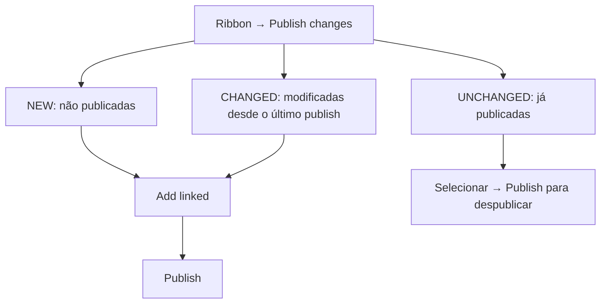

> [!abstract]
> **Obsidian Publish** é o serviço de hospedagem em nuvem que transforma um subconjunto explicitamente selecionado das notas do seu vault em um site — wiki, base de conhecimento, documentação ou digital garden — em `publish.obsidian.md/seu-site`.

## Conceito

A premissa do Publish é a **seleção explícita**. Nada vai ao ar por estar no vault: você escolhe nota a nota, e o resto permanece no vault local. "Only the notes you choose to publish are sent to Obsidian's servers, and any notes you unpublish are removed."

Isso o coloca em oposição direta ao [[Obsidian Sync]]: um é unidirecional e público, o outro bidirecional e privado. E o Publish tem uma limitação estrutural que decorre disso — ele **não sincroniza mudanças entre os vaults locais dos colaboradores**; para isso é preciso outra ferramenta.

A infraestrutura é contratada da Cloudflare, com servidores em San Francisco, CA. Ver [[Content Delivery Network (CDN)]].

## Fluxo de publicação

- **NEW** lista as notas ainda não publicadas; **CHANGED**, as modificadas; **UNCHANGED**, as já publicadas — e é por ela que se **despublica**
- **`Add linked`** inclui automaticamente as notas ligadas, evitando links quebrados; ele respeita as exclusões configuradas
- **Deleção de notas renomeadas ou removidas acontece nesse mesmo passo**, e o checkbox **não é marcado automaticamente, por segurança** — é preciso marcá-lo manualmente

## Properties do Publish

| Property | Efeito |
|---|---|
| `publish` | `true` inclui automaticamente a nota; `false` a ignora |
| `permalink` | Define a URL canônica da página |
| `description` | Descrição usada nos social sharing cards |
| `image` / `cover` | Imagem usada nos social sharing cards |

> [!important] `publish: true` overrides excluded folders
> "If a file has `publish: true`, it will still be published even if it is in a folder or filter that is excluded. This is because `publish: true` gives more specific control." A property vence a pasta. Ver [[Properties (Frontmatter)]].

**Permalink × alias.** São coisas diferentes e complementares: `permalink: about` transforma `.../Company/About+us` em `.../about` e redireciona quem chega pela URL original. Já para redirecionar URLs *antigas* de notas movidas ou renomeadas, adiciona-se um [[Alias (Obsidian)|alias]] na nota de destino — e ele precisa conter **o caminho completo** da nota antiga, `Guides/Making friends`, não só o nome. No vault local o nome bastaria; no Publish, não.

## Customização

- `publish.css` e `publish.js` na **raiz do vault** (`/`), publicados como qualquer outro arquivo. Não aparecem no file explorer por padrão, mas aparecem no diálogo Publish changes
- **`publish.js` exige custom domain**
- O Publish **não lê a configuration folder**: para usar um community theme, copia-se o `.css` de `.obsidian/themes` para a raiz e renomeia-se para `publish.css`. Style Settings não funciona
- `favicon-32x32.png`, `favicon-32.png` ou `favicon.ico`, em qualquer lugar do vault desde que publicados
- **Site options** controlam Reading experience e Components — graph view, table of contents, light/dark; **Customize navigation** reordena e oculta itens do file explorer publicado

## Segurança e privacidade

- **Site password** protege **o site inteiro**; removê-la torna tudo público de novo. "Individual password protection for published notes is currently not supported"
- Por padrão o Publish **não coleta dados de visitante, não armazena cookies e não processa informação pessoal** — mas a responsabilidade por GDPR, banner de consentimento e página de política é do dono do site
- É possível desabilitar a indexação por buscadores nas site options; sitemap em `/sitemap.xml` e feed em `/rss.xml`

## Limitações

- **Community plugins**: suporte mínimo. Plugins que emitem **markdown puro** funcionam, porque não precisam do app para renderizar; os que dependem de um codeblock renderizado pelo plugin não funcionam por padrão
- **Busca**: só texto plano, com preferência por file names → aliases → header names → texto das notas. **Embedded search results não são suportados**
- **Mídia**: até **50 MB por arquivo** e **4 GB por site**; não otimizado para vídeo ou áudio grandes — a recomendação é hospedar em serviço externo
- **PDFs**: em telas pequenas, mobile e tablets, o PDF embutido pode não carregar ou mostrar só a primeira página
- **Graph**: apenas customização básica de cor via CSS, sem as opções de ordenação e visualização do [[Graph View]] do app

## Colaboração

Apenas o dono do site precisa de assinatura ativa; colaboradores só precisam de uma conta Obsidian. Colaboradores podem publicar páginas novas, publicar alterações e despublicar; **configurar site options e gerenciar permissões é só do dono**.

## Comparação

| | Obsidian Publish | [[Obsidian Sync]] |
|---|---|---|
| Direção | Unidirecional, vault → site | Bidirecional entre dispositivos |
| Audiência | Pública, ou protegida por senha de site | Privada |
| Escopo | **Subconjunto explícito** de notas | Vault inteiro, menos exclusões |
| Criptografia | Nenhuma — é para ser lido | E2EE por padrão |
| Quem paga | Só o dono do site | Cada colaborador |
| Sincroniza vaults locais | **Não** | Sim |

## Veja também

- [[Obsidian Sync]]
- [[Content Delivery Network (CDN)]]
- [[Alias (Obsidian)]]
- [[Properties (Frontmatter)]]
- [[Publicar um Vault com Obsidian Publish]]
