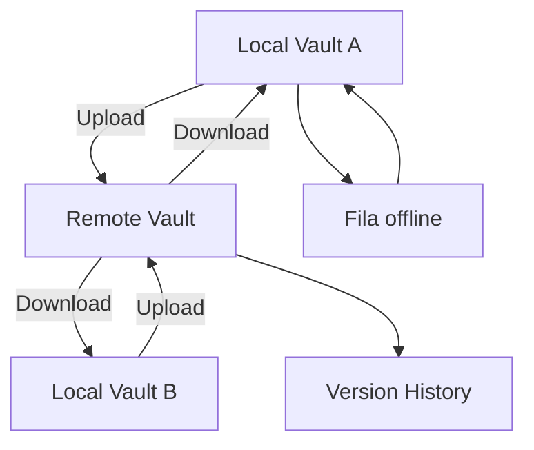

> [!abstract]
> **Obsidian Sync** é o serviço pago add-on que sincroniza notas entre dispositivos de forma privada, conectando cada local vault a um [[Remote Vault|remote vault]] centralizado gerenciado pelo próprio app.

## Conceito

O Sync existe porque serviços file-based são implementados de forma inconsistente entre sistemas operacionais, e o mobile é o caso pior — apps são sandboxed e sofrem power throttling. Ao mover a sincronização para dentro do aplicativo, o Obsidian obtém comportamento uniforme independentemente do dispositivo.

A contrapartida é a mais importante de todas, e é fácil interpretar mal:

> [!quote] Is my data being synced in the background?
> "No, files are only synced when Obsidian is running."

Não há daemon. Se o app está fechado, nada sobe e nada desce. Isso preserva a lógica [[Local-first]] — o vault local continua plenamente funcional offline — mas significa que o Sync não substitui um [[Backup]].

O rastreamento é **em nível de arquivo**: só os arquivos modificados são transferidos, não pastas inteiras, o que reduz banda e tempo. Mudanças feitas offline entram numa **fila** e sobem quando o dispositivo reconecta e o Obsidian está aberto.

## Fluxo

## Ícones de status

Na status bar no desktop e na sidebar direita no mobile:

- **Synced** — tudo sincronizado, tipicamente verde
- **Syncing** — atualizando o remote vault, geralmente roxo
- **Paused** — sincronização pausada, ainda conectado ao remote vault
- **Disconnected** — o core plugin está ativo, mas o local vault não está conectado a nenhum remote vault, tipicamente vermelho

O Sync log registra uploads, downloads, deleções e conflitos, filtrável por All, Errors, Skipped e Merge Conflicts. **Ele não persiste depois que o Obsidian é fechado** — copie antes de sair.

## Planos

| | Sync Standard | Sync Plus |
|---|---|---|
| Synced vaults | 1 | 10 |
| Tamanho máximo de arquivo | 5 MB | 200 MB |
| Armazenamento total | 1 GB | 10 GB a 100 GB |
| [[Version History]] | 1 mês | 12 meses |
| Devices | Ilimitados | Ilimitados |
| Shared vaults | Sim | Sim |

> [!important] O limite é da conta, não do vault
> "There is no per-vault limit. The storage limit is tied to your used account and can be applied across all your vaults." Version history e [[Attachment|attachments]] contam para esse limite. Ao atingi-lo, o Sync **para de sincronizar** e pede que você faça prune do remote vault.

## Regiões

Automatic — escolhida pelo IP no momento da configuração — Singapore, Frankfurt, San Francisco e Sydney.

> [!warning] Mudar de região é destrutivo
> Trocar de região exige **recriar o vault** em outro servidor. Os dados remotos são removidos e reenviados, e **todo o version history do vault é perdido**. Faça backup antes.

## Selective sync e configuration sync

- **Selective sync** vem ativo por padrão para Images, Audio, Videos e PDFs. Outros tipos exigem o toggle `Sync all other types`
- **Vault configuration sync** cobre por padrão: other file types, main settings, appearance, themes and snippets, hotkeys, active core plugin list e core plugin settings. Para sincronizar community plugins é preciso **habilitar manualmente** *Active community plugin list* e *Installed community plugin list*
- **As próprias Sync settings não sincronizam** — device name, conflict resolution e selective sync precisam ser configurados dispositivo a dispositivo
- Sempre excluídos: os snapshots do [[File Recovery]], que vivem nas Global settings, e **qualquer arquivo ou pasta começando por `.`** — `.git`, `.vscode`, `.gitignore`. A **única exceção** é a [[Configuration Folder|configuration folder]] `.obsidian`, que sincroniza
- Adicionar um arquivo à lista Excluded **não o remove** do remote vault se ele já subiu

## Conflict resolution

Um conflito acontece quando o mesmo arquivo muda em dois dispositivos antes de sincronizarem.

- **Markdown**: merge automático pelo algoritmo diff-match-patch do Google
- **Demais tipos, inclusive [[Canvas|canvases]]**: "last modified wins" — a versão mais recente substitui as anteriores
- **Settings**: merge dos JSON, aplicando as chaves locais sobre as remotas
- A opção `Create conflict file` gera um arquivo separado em vez de mesclar, no padrão `original-note-name (Conflicted copy device-name YYYYMMDDHHMM).md`

## Shared vault

Até **20 colaboradores**. Todos precisam de assinatura Sync ativa própria, mas o vault compartilhado **não conta** para o limite de vaults do convidado. Não há live editing — você não vê o cursor do outro, e as edições só aparecem após o sync. Permissões granulares não existem: todos têm os mesmos direitos do dono, exceto convidar.

## Comparação

| | Obsidian Sync | Sync file-based |
|---|---|---|
| Topologia | Remote vault centralizado | Pasta monitorada como passthrough |
| Onde o vault pode ficar | Quase qualquer pasta, HD externo, `C:\` | Só dentro da pasta do serviço |
| Sincroniza em background | **Não** — só com o Obsidian aberto | Sim, se o serviço tiver |
| Granularidade | Por arquivo modificado | Por arquivo do sistema |
| Conflitos | Merge por diff-match-patch em Markdown | Regra do serviço |
| Criptografia | E2EE por padrão no remote | Depende do provedor |

## Veja também

- [[Remote Vault]]
- [[End-to-End Encryption]]
- [[Version History]]
- [[Backup]]
- [[Configurar Sync com Sincronização Seletiva]]
