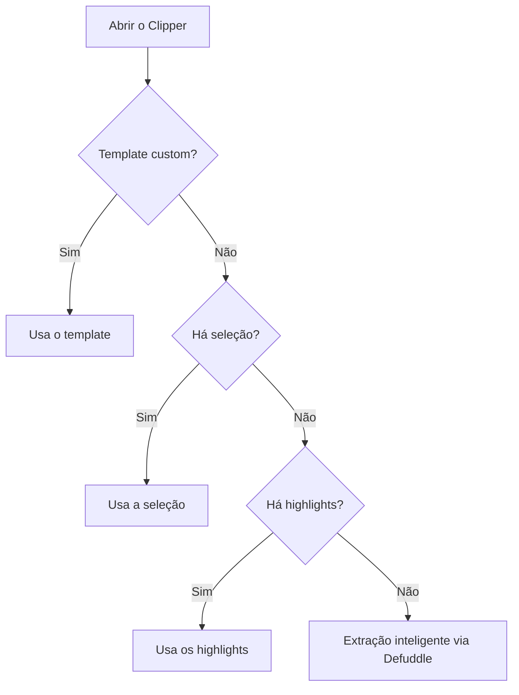

> [!abstract]
> **Obsidian Web Clipper** é a extensão de navegador gratuita e open source que destaca páginas web e salva seu conteúdo, já convertido em Markdown, diretamente no seu vault local.

## Conceito

O Clipper resolve a captura, mas o que o distingue de um "salvar para ler depois" é a **normalização na entrada**: a página vira Markdown com [[Properties (Frontmatter)|properties]] preenchidas, no formato que você definiu, no momento da captura — não depois. O template é um contrato sobre o que entra no vault.

Ele salva **localmente no vault** e segue a política de privacidade do Obsidian: os dados não são coletados e nenhuma métrica de uso é reunida. O código é open source e auditável.

Disponível para Chrome e outros navegadores Chromium — Brave, Arc, Orion —, Firefox e Firefox Mobile, Safari em macOS, iOS e iPadOS, e Microsoft Edge.

## Precedência de captura

Por padrão o Clipper tenta extrair apenas o conteúdo principal do artigo, excluindo header, footer e demais elementos, usando **Defuddle** — o parser HTML-para-Markdown do projeto. Quando o Defuddle é conservador demais e remove o que você queria, selecionar texto com `Cmd/Ctrl+A` ou usar highlights o contorna.

| Ação | macOS | Windows/Linux |
|---|---|---|
| Open clipper | `Cmd+Shift+O` | `Ctrl+Shift+O` |
| Quick clip | `Opt+Shift+O` | `Alt+Shift+O` |
| Toggle highlighter | `Opt+Shift+H` | `Alt+Shift+H` |
| Toggle reader | `Opt+Shift+R` | `Alt+Shift+R` |

> [!warning] Imagens não são baixadas
> As imagens ficam apontando para a URL original, o que economiza espaço no vault mas as torna indisponíveis offline ou se a URL morrer. Para baixá-las, use depois o comando **Download attachments for current file** no Obsidian — mapeável a uma hotkey. Ver [[Attachment]].

## Templates e triggers

Um template define o **behavior** — criar nota nova, adicionar ao topo ou ao fim de uma nota existente, ou adicionar à [[Daily Note|daily note]] — e pode ser disparado automaticamente por três tipos de regra:

- **URL simples**: `https://obsidian.md` casa qualquer URL que *comece* com esse texto
- **Regex** entre barras: `/^https:\/\/www\.imdb\.com\/title\/tt\d+\/reference\/?$/`
- **schema.org** com o prefixo `schema:`: `schema:@Recipe`, `schema:@Recipe.name`, `schema:@Recipe.name=Cookie`

> [!important] A primeira correspondência vence
> A ordem da lista de templates determina o resultado, e ela é arrastável. Se nenhuma regra casar, o Clipper usa **o primeiro template da lista** — por isso o fallback deve ficar no topo.

## Os cinco tipos de variável

| Tipo | Sintaxe de exemplo |
|---|---|
| **Preset** | `{{title}}`, `{{content}}`, `{{author}}`, `{{url}}`, `{{published}}` |
| **Prompt** | `{{"a summary of the page"}}` — as aspas duplas são o que distingue |
| **Meta** | `{{meta:name:description}}`, `{{meta:property:og:title}}` |
| **Selector** | `{{selector:h1}}`, `{{selector:img.hero?src}}`, `{{selectorHtml:body}}` |
| **Schema.org** | `{{schema:@Type:key}}`, `{{schema:author[*].name}}` |

Variáveis podem ser usadas no nome da nota, na localização, nas properties e no conteúdo.

## Filtros e lógica

Filtros modificam variáveis com `{{variable|filter}}` e são **encadeáveis** — `{{variable|filter1|filter2}}`, aplicados na ordem em que aparecem. As categorias documentadas: datas, conversão e capitalização de texto, formatação de texto, números, processamento de HTML e arrays e objetos.

A lógica de template é inspirada em Twig e Liquid: `` com `` e ``, ``, ``, o operador de fallback `??` encadeável, e dentro dos loops um objeto `loop` com `loop.index`, `loop.index0`, `loop.first`, `loop.last` e `loop.length`.

> [!important] Ordem de avaliação
> Primeiro a lógica de template e as variáveis; **depois** os prompt variables são enviados ao Interpreter. Isso significa que você pode montar prompts dinamicamente com lógica, mas **os resultados de prompt não estão disponíveis em condicionais nem em loops**.

## Interpreter

O Interpreter usa um [[Large Language Model (LLM)|modelo de linguagem]] para extrair e transformar dados por linguagem natural. Quando você clica em **interpret**, ele envia o contexto da página junto com **todos os prompts do template em uma única requisição**.

- Providers preset incluem Anthropic, Azure OpenAI, DeepSeek, Google Gemini, Hugging Face, Meta, Ollama, OpenAI, OpenRouter, Perplexity e xAI Grok; provedores e modelos custom também são configuráveis
- A recomendação é usar **modelos pequenos** — Claude Haiku, Gemini Flash, Llama de 3B ou 8B, a série Mini da OpenAI — por serem mais rápidos e razoavelmente precisos nessa tarefa
- **O contexto padrão é o HTML inteiro da página**, o que deixa os prompts mais lentos e caros do que o necessário. Reduz-se definindo o contexto por template com uma selector variable como `{{selectorHtml:#main}}`, e filtros como `remove_html`, `strip_tags` e `strip_attr`
- **Ollama** roda modelos localmente, sem API key; exige iniciar o servidor com `OLLAMA_ORIGINS` liberando o protocolo da extensão, e atenção ao `num_ctx`, que por padrão é 2048 tokens e falha silenciosamente ao ser excedido

## Highlighter e Reader

O **Highlighter** marca texto, imagens e elementos na página, e os highlights **ficam salvos** — você os vê ao voltar. Três modos de inserção na nota: *Highlight the page content*, que insere com a sintaxe `==highlight==` do [[Obsidian Flavored Markdown (OFM)]]; *Replace the page content*, que devolve só a lista de highlights; e *Do nothing*, que devolve o conteúdo original. Highlights são exportáveis para `.json`.

O **Reader** é o modo de leitura limpo: título, autor, data, domínio, conteúdo principal com imagens e formatação, outline na sidebar, syntax highlighting em code blocks e footnote popovers.

## Comparação

| | Selector / Schema variable | Prompt variable |
|---|---|---|
| Depende de | Estrutura HTML ou JSON-LD do site | Modelo de linguagem |
| Funciona bem quando | O formato é **consistente** | O formato é **inconsistente entre sites** |
| Velocidade | Imediata | De milissegundos a mais de 30 segundos |
| Custo e privacidade | Nenhum | Depende do provider escolhido |
| Portabilidade | Costuma servir a um site só | Um template de livros serve a qualquer site de livros |

## Veja também

- [[Large Language Model (LLM)]]
- [[Properties (Frontmatter)]]
- [[Attachment]]
- [[Obsidian Flavored Markdown (OFM)]]
- [[Captura Web com Template de Clipper]]
