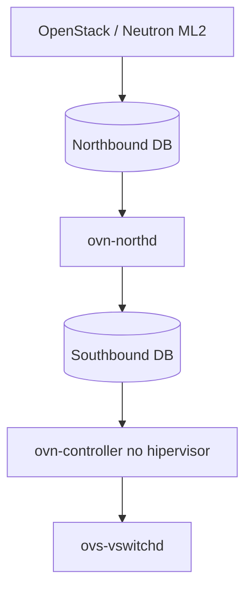

> [!abstract]
> Camada de virtualização de rede construída sobre o [[Open vSwitch (OVS)]] que separa o controle do encaminhamento, tornando o fluxo de pacotes programável centralmente.

## Conceito

É a implementação madura da filosofia [[Software-Defined Networking (SDN)]] no OpenStack, e o mechanism driver preferido nos releases recentes.

A diferença essencial em relação ao OVS puro: o OVN **desacopla a função de controle do dispositivo de rede da função de encaminhamento**. O operador define regras de fluxo num modelo lógico central; os controladores traduzem isso em regras OpenFlow em cada host.

Suporta VLAN, VXLAN (a partir da versão 20.09), flat e **GENEVE** — o tipo padrão.

## Estrutura

| Construto | Referência | Papel |
|---|---|---|
| **Northbound DB** | `ovnnb.db` | Visão de alto nível das redes virtuais do CMS. Tabelas `Logical_Router`, `Logical_Switch_Port` |
| **Southbound DB** | `ovnsb.db` | Ligação entre fluxo lógico e físico. Tabelas `Port_Binding`, `Logical_Flow` |
| **`ovn-northd`** | Control plane | Traduz a configuração lógica do NB em fluxos de datapath no SB |
| **`ovn-controller`** | Hipervisor | Converte fluxo lógico em físico e programa o OVS local |
| **`ovs-vswitchd`** | Data plane | Aplica as regras de encaminhamento |

## Características

**Roteamento L3 nativo**, em dois modos:

| Modo | Comportamento |
|---|---|
| Centralizado | Todo tráfego passa pelo nó de rede. Sem floating IP distribuído |
| **DVR** | Ver [[Distributed Virtual Routing (DVR)]] — tráfego roteado direto do nó de computação. Recomendado |

**GENEVE × [[VXLAN]]:** o VXLAN codifica apenas o VNI no cabeçalho (8 bytes). O GENEVE usa TLV extensível (38 bytes) e carrega portas de ingresso e egresso — habilitando segurança de transporte, service chaining e telemetria in-band.

## Veja também

- [[Open vSwitch (OVS)]]
- [[Neutron]]
- [[Software-Defined Networking (SDN)]]
- [[Distributed Virtual Routing (DVR)]]
