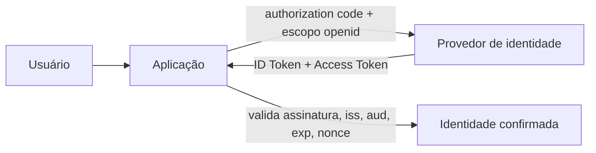

> [!abstract]
> OpenID Connect é a **camada de identidade sobre [[OAuth 2.0]]**: responde "quem é este usuário?", pergunta que o OAuth sozinho não responde.

## Conceito

[[OAuth 2.0]] é um protocolo de **autorização**. Ele entrega um access token que diz o que a aplicação pode fazer, não quem é o usuário. Usar esse token como prova de identidade é a origem clássica de implementações inseguras — o token foi emitido para outra finalidade e pode ter sido obtido por outro cliente.

OIDC acrescenta o que falta: um **ID Token**, no formato [[JSON Web Token (JWT)]], contendo claims padronizadas sobre o usuário e sobre a própria autenticação.

## O ID Token

| Claim | Significado |
|---|---|
| `iss` | Quem emitiu — deve ser o provedor esperado |
| `sub` | Identificador estável do usuário |
| `aud` | Para qual cliente foi emitido — deve ser o seu |
| `exp` | Quando expira |
| `iat` | Quando foi emitido |
| `nonce` | Liga o token à requisição de autenticação, contra replay |

> [!warning] Validar todas as claims, não só a assinatura
> Assinatura válida prova apenas que o provedor emitiu o token — não que ele foi emitido **para você**. Sem checar `aud`, uma aplicação aceita tokens emitidos para outro cliente do mesmo provedor. Sem checar `nonce`, aceita replay.

## Diferenças que importam

| | **[[OAuth 2.0]]** | **OpenID Connect** |
|---|---|---|
| Responde | O que pode fazer? | Quem é? |
| Token principal | Access Token | ID Token |
| Formato | Opaco ao cliente | JWT, com claims padronizadas |
| Consumidor do token | Servidor de recursos | A **própria aplicação** |
| Descoberta | — | Endpoint de metadados padronizado |

> [!important]
> OIDC é o que sustenta o "Entrar com..." moderno e o [[Single Sign-On (SSO)]] fora do ambiente corporativo — onde SAML ainda domina. Como roda sobre OAuth, herda o Authorization Code com PKCE como fluxo recomendado.

## Fonte

- OpenID Foundation, [OpenID Connect Core 1.0](https://openid.net/specs/openid-connect-core-1_0.html)

## Veja também

- [[OAuth 2.0]]
- [[JSON Web Token (JWT)]]
- [[Single Sign-On (SSO)]]
- [[Identity Federation]]
- [[Authentication]]
- [[Zero Trust]]
- [[System Design MOC]]
