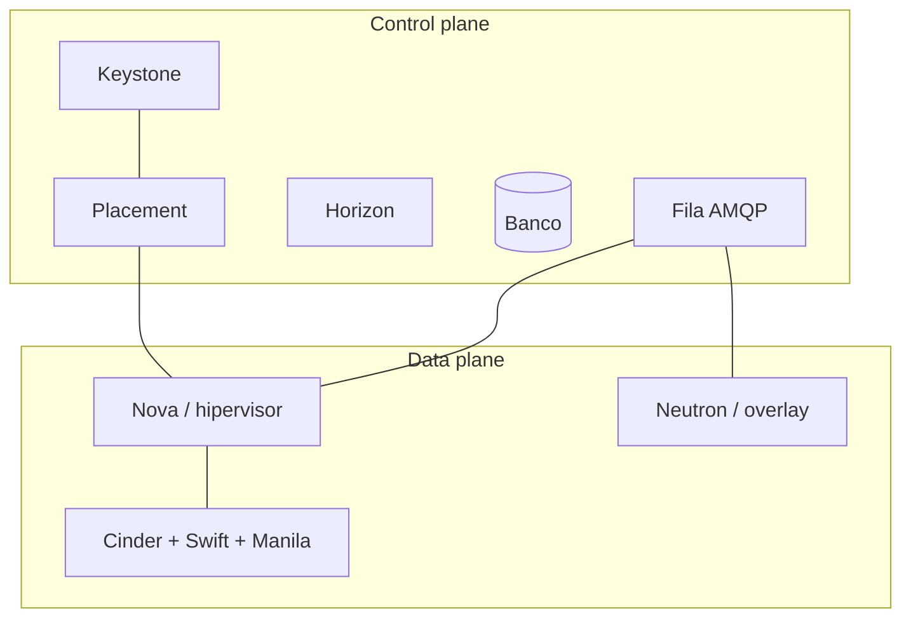

> [!abstract]
> Plataforma open source que transforma pools de computação, rede e armazenamento em serviços consumíveis sob demanda por API — na prática, um sistema operacional de nuvem privada.

## Conceito

Nasceu em 2010 do release **Austin**, iniciativa conjunta de NASA e Rackspace, para resolver o paradigma [[Infrastructure as a Service (IaaS)]] com software livre. É a quarta maior comunidade open source do mundo.

O que sustenta o projeto não é nenhum serviço em particular, e sim duas decisões de arquitetura:

- **Design modular** — cada capacidade é um projeto independente, com ciclo de release próprio. Serviços entram e saem do catálogo sem quebrar o núcleo.
- **API em tudo** — escrito majoritariamente em Python, cada serviço expõe uma API REST, e toda comunicação entre serviços passa por ela. É isso que permite automação, extensão por terceiros e integração com nuvens públicas.

## Estrutura

## Características

- **Commodity hardware** — projetado para escalar horizontalmente sobre hardware genérico, não sobre appliances.
- **Releases nomeados em ordem alfabética** — Austin, Grizzly, Havana, Icehouse, Juno, Kilo, Liberty, Mitaka, Newton, Ocata, Train, Ussuri, Yoga, Antelope, Bobcat.
- **Núcleo estável, periferia experimental** — a comunidade descontinua projetos incubados que não amadurecem, para não comprometer a estabilidade do conjunto.
- **Compatibilidade com o mundo público** — expõe uma API compatível com EC2 e mantém drivers para recursos AWS.

## Comparação

| | OpenStack | Nuvem pública hyperscaler |
|---|---|---|
| Controle do hardware | Total | Nenhum (com exceções pontuais) |
| Modelo de custo | CapEx + operação | Pay-as-you-go |
| Catálogo de serviços | IaaS sólido, PaaS limitado | IaaS + PaaS + SaaS |
| Presença geográfica | O que você construir | Dezenas de regiões prontas |
| Lock-in | Baixo | Alto sem mitigação deliberada |

## Veja também

- [[Infrastructure as a Service (IaaS)]]
- [[Control Plane]]
- [[Hybrid Cloud]]
- [[Kolla-Ansible]]
- [[Mastering OpenStack]]
