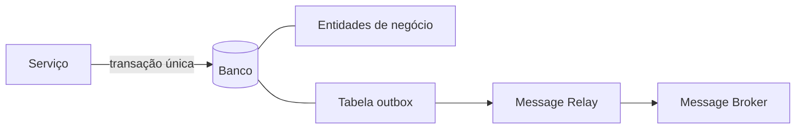

> [!abstract]
> Outbox Pattern resolve o problema de **atualizar a base e publicar a mensagem atomicamente**: a mensagem é gravada em uma tabela `outbox` dentro da mesma transação de negócio, e um processo separado a envia ao broker depois.

## Conceito

Um serviço que participa de uma [[Saga]] ou publica [[Domain Events]] precisa fazer duas coisas de uma vez: gravar a mudança no banco e mandar a mensagem. Sem 2PC entre banco e broker — que não é opção — as duas ordens ingênuas falham:

- **Publicar durante a transação** → não há garantia de que a transação vai commitar. Pode-se anunciar algo que não aconteceu
- **Publicar depois do commit** → não há garantia de que o processo não vai morrer antes de publicar. Pode-se esquecer de anunciar algo que aconteceu

Há ainda a exigência de **ordem**: se `T1 → E1` e `T2 → E2`, o evento `E1` precisa ser publicado antes de `E2`, mesmo que as transações tenham ocorrido em instâncias diferentes do serviço.

## Solução

A mensagem é gravada na tabela `outbox` **como parte da mesma transação** que atualiza as entidades de negócio. Um **message relay** separado lê a outbox e publica no broker.

Em banco relacional a outbox é uma tabela; em NoSQL, costuma ser uma propriedade de cada documento.

O relay pode ser implementado de duas formas:

| Implementação | Como funciona |
|---|---|
| **Transaction log tailing** | Lê o log de replicação do banco (CDC) e publica o que aparece |
| **Polling publisher** | Consulta a tabela outbox periodicamente |

## Resultado

✅ Não usa 2PC
✅ A mensagem é enviada **se e somente se** a transação commitar
✅ A ordem de envio ao broker é a ordem em que o serviço as produziu

⚠️ Propenso a erro humano: o desenvolvedor pode esquecer de gravar o evento na outbox ao atualizar a entidade

> [!warning] Entrega ao menos uma vez
> O relay pode publicar a mesma mensagem mais de uma vez — por exemplo, caindo depois de publicar e antes de registrar que publicou. Ao reiniciar, publica de novo.
>
> Por isso o consumidor **precisa ser idempotente**, tipicamente rastreando os IDs de mensagem já processados. Na prática isso raramente é um custo extra: brokers já entregam mais de uma vez por desenho, então o consumidor teria de ser idempotente de qualquer forma. Ver [[Idempotência]].

## Alternativa

[[Event Sourcing]] resolve o mesmo problema por outro caminho: se o evento **é** a forma de persistir a mudança, não existem duas escritas a coordenar.

## Fonte

- Chris Richardson, [Pattern: Transactional outbox](https://microservices.io/patterns/data/transactional-outbox.html), microservices.io

## Veja também

- [[Saga]]
- [[Domain Events]]
- [[Event Sourcing]]
- [[Idempotência]]
- [[Message Queue]]
- [[Two-Phase Commit]]
- [[System Design MOC]]
