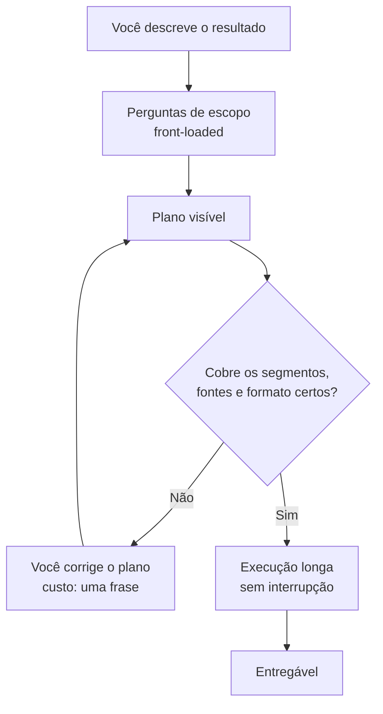

> [!abstract]
> **Plano Revisável** é a etapa em que o agente, antes de executar, faz as perguntas de escopo que faltam e devolve a sequência que pretende seguir — para que a correção aconteça no plano, e não no entregável.

## Conceito

Um [[Agentic Workflow|fluxo agêntico]] concentra o risco no início: o agente vai rodar por muitos passos sem você, e um mal-entendido de escopo no primeiro minuto reaparece como um deck inteiro construído sobre o recorte errado.

O plano revisável desloca esse risco para onde ele é barato. O agente pergunta o que ainda está indeterminado — foco de mercado, recorte geográfico, horizonte de tempo, o que conta como urgente, como formatar a saída — monta a sequência e a expõe **antes** de tocar em qualquer arquivo.

A troca é contraintuitiva: um punhado de perguntas no começo compra **menos** interrupção depois. Com o escopo fixado, o agente sustenta execuções longas sem precisar voltar a cada bifurcação, e o resultado chega mais perto de pronto.

## Características

- **Perguntas antecipadas** — a indeterminação é resolvida antes, não descoberta no meio
- **Explícito e legível** — o plano aparece como artefato, não como intenção implícita
- **Editável** — corrigir o plano é uma frase; corrigir o entregável é uma refação
- **Habilita autonomia** — quanto mais fixado o escopo, mais longo o trecho que o agente roda sozinho

> [!important] O plano é o ponto de correção mais barato do fluxo
> Revisar cobertura (segmentos, geografias, frameworks, fontes) no plano custa segundos. A mesma revisão feita sobre três arquivos gerados custa a geração inteira de novo.

## Comparação

| Momento da correção | Custo | O que você revisa |
|---|---|---|
| Nas perguntas de escopo | Mínimo | Se o agente entendeu o pedido |
| No plano | Baixo | Se a sequência cobre o necessário |
| Durante a execução | Médio | Ver [[Observabilidade de Sessão Agêntica]] |
| No entregável | Alto | Refação total ou aceitação do errado |

## Veja também

- [[Agentic Workflow]]
- [[Observabilidade de Sessão Agêntica]]
- [[Claude Cowork]]
- [[Escolha da Forma de Trabalho com IA]]
- [[Human-in-the-Loop]]
- [[Iteração sobre a Resposta da IA]]
