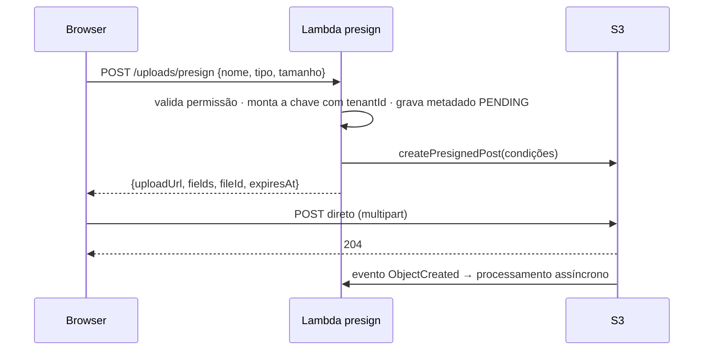

> [!abstract]
> Pre-signed URL é uma URL temporária que carrega, na própria assinatura, a permissão para executar uma operação específica em um objeto — permitindo que um cliente sem credenciais leia ou grave direto no armazenamento.

## Conceito

O problema que resolve: o arquivo do usuário não pode passar pelo backend. Um upload roteado por [[Amazon API Gateway]] esbarra no limite de tamanho do payload, ocupa a função pelo tempo inteiro da transferência (que é faturado) e transforma uma operação de I/O puro em custo de computação.

A URL pré-assinada inverte o fluxo: o backend **autoriza** sem **transportar**. Ele decide quem pode gravar o quê, onde e por quanto tempo, e devolve ao cliente uma credencial de uso único embutida na URL. O byte vai direto do browser ao armazenamento.

## Condições — onde mora a segurança

A assinatura não é um cheque em branco. As condições declaradas na hora de assinar são verificadas pelo próprio S3 no momento do upload:

| Condição | Protege de |
|---|---|
| Chave exata (com o `tenantId` no prefixo) | Gravar sobre o objeto de outro tenant |
| `content-length-range` | Upload de arquivo gigante que estoura o custo de armazenamento |
| `eq $Content-Type` | Enviar um executável declarando ser uma imagem |
| `Expires` curto (minutos) | Reuso da URL vazada |

> [!important] Quem monta a chave é o servidor, nunca o cliente
> Se o nome do arquivo enviado pelo cliente entra na chave sem sanitização, `../` e nomes forjados viram gravação fora do prefixo esperado. A chave é sempre construída no backend a partir do contexto autenticado: `{tenantId}/{dominio}/{uuid}/{nome-sanitizado}`.

## O metadado vem antes do arquivo

O registro no banco é criado **junto com a assinatura**, em estado `PENDING`, e promovido a `READY` pelo consumidor do evento de criação do objeto. Sem esse par, o sistema não distingue "upload em andamento" de "upload abandonado" — e objetos órfãos acumulam custo silenciosamente. Uma *lifecycle policy* que expira objetos incompletos fecha o ciclo.

## Também vale para leitura

O mesmo mecanismo, com verbo `GET`, entrega download temporário de arquivo privado sem tornar o bucket público e sem proxy no backend — o caminho padrão para anexos e relatórios gerados.

## Veja também

- [[Amazon S3]]
- [[Upload Direto com URL Pré-assinada]]
- [[Multi-Tenancy]]
- [[Segurança de API]]
- [[Object Storage]]
