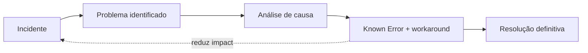

> [!abstract]
> Problem é a causa, ou causa potencial, de um ou mais incidentes.

## Conceito

O problema é a entidade que sobrevive ao incidente. Enquanto o incidente é fechado quando o serviço volta, o problema permanece aberto enquanto a causa existir.

Manter as duas entidades separadas é o que impede a métrica mais enganosa da operação: fechar rápido muitos incidentes idênticos e chamar isso de eficiência.

## Ciclo

## Características

- Pode existir sem nunca ter causado incidente (proativo)
- Sua resolução é frequentemente uma mudança, não um reparo
- Um workaround documentado já entrega valor antes da correção

## Veja também

- [[Incident]]
- [[Known Error]]
- [[Problem Management]]
- [[Error]]
