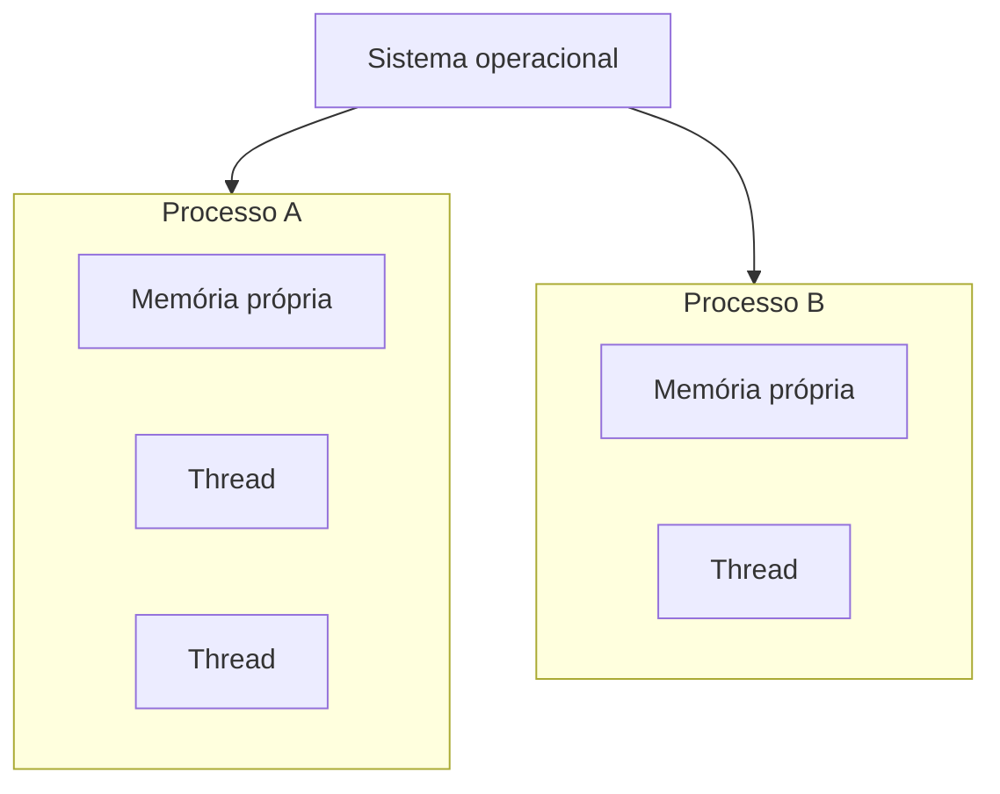

> [!abstract]
> Processo é uma instância de programa em execução, com **espaço de memória próprio e isolado** dos demais — a unidade de isolamento que o sistema operacional oferece.

## Conceito

O programa é um arquivo estático; o processo é ele **rodando**, com estado. O sistema operacional dá a cada processo a ilusão de possuir a máquina inteira: seu próprio espaço de endereçamento, sua tabela de descritores de arquivo, seus registradores.

Esse isolamento é a garantia central: um processo que corrompe a própria memória ou termina abruptamente **não derruba os vizinhos**.

## Comparação com [[Thread]]

| | **Processo** | **Thread** |
|---|---|---|
| Espaço de memória | Próprio e isolado | Compartilhado com as demais do processo |
| Custo de criação | Alto | Baixo |
| Troca de contexto | Cara — troca a tabela de páginas | Barata |
| Comunicação | IPC: pipe, socket, memória compartilhada | Variáveis compartilhadas, direto |
| Falha | Isolada ao processo | Derruba o processo inteiro |

## Por que isso aparece em arquitetura

> [!important] É a mesma decisão de isolamento, em outra escala
> Processo × thread é o trade-off entre **isolamento** e **custo de comunicação** no nível do sistema operacional. Monólito × [[Microservices]] é o mesmo trade-off no nível da arquitetura; [[Bulkhead]] é o mesmo no nível dos pools de recurso.
>
> Em todos os três, mais isolamento significa mais resiliência e mais custo por interação.

Em [[Container]] essa relação é explícita: o contêiner é isolamento de processo — namespaces e cgroups — e não virtualização de hardware. É por isso que ele sobe em segundos e por isso que compartilha o kernel do host.

## Fonte

- IEEE, *Std 1003.1 — POSIX*, definição de processo
- Andrew S. Tanenbaum, *Modern Operating Systems*, Pearson

## Veja também

- [[Thread]]
- [[Container]]
- [[Processo de Boot do Linux]]
- [[Bulkhead]]
- [[Microservices]]
- [[System Design MOC]]
