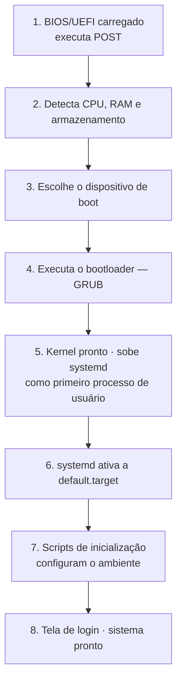

> [!abstract]
> A sequência de oito etapas que leva a máquina de "energia ligada" a "tela de login" — do firmware ao primeiro processo de espaço de usuário.

## Conceito

Cada etapa existe para preparar a seguinte, e o problema de fundo é sempre o mesmo: quem inicializa o inicializador. A cadeia começa em firmware gravado em memória não volátil e termina em um processo comum.

| Etapa | O que acontece |
|---|---|
| **1** | BIOS ou UEFI é carregado da memória não volátil e roda o POST (*Power On Self Test*) |
| **2** | O firmware detecta os dispositivos conectados: CPU, RAM, armazenamento |
| **3** | Escolhe de onde arrancar — disco, servidor de rede ou mídia removível |
| **4** | O firmware executa o **bootloader** (GRUB), que oferece o menu de sistemas e kernels |
| **5** | Com o kernel pronto, passa-se ao espaço de usuário: o kernel sobe o **systemd** como primeiro processo, que gerencia processos e serviços, sonda o hardware restante, monta os sistemas de arquivos e sobe o ambiente gráfico |
| **6** | O systemd ativa a `default.target`, e com ela as demais unidades |
| **7** | Scripts de inicialização configuram o ambiente |
| **8** | O usuário recebe a tela de login |

> [!important] Por que isto importa fora do sysadmin
> A etapa 5 é a fronteira entre **kernel space** e **user space** — a mesma fronteira que explica por que o [[Container]] é leve. O contêiner não repete as etapas 1 a 4: ele reaproveita o kernel do host e começa direto em um processo isolado. É a razão de subir em segundos, contra minutos de uma máquina virtual.

> [!tip]
> Diagnosticar boot é identificar em que etapa parou: tela preta antes do GRUB aponta firmware ou disco; kernel panic aponta a etapa 5; travar depois do systemd aponta unidade de serviço.

## Fonte

- ByteByteGo, *Linux Boot Process Illustrated* — BIG ARCHIVE: System Design 2023
- freedesktop.org, [systemd — System and Service Manager](https://systemd.io/)

## Veja também

- [[Processo (Computação)]]
- [[Filesystem Hierarchy Standard (FHS)]]
- [[Container]]
- [[Comandos Linux Essenciais]]
- [[System Design MOC]]
