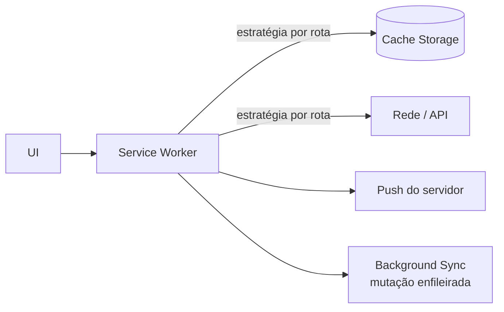

> [!abstract]
> PWA é a aplicação web que usa capacidades da plataforma — service worker, manifesto e APIs modernas — para se comportar como aplicativo instalado: abre offline, aparece na tela inicial e recebe notificações.

## Conceito

A promessa não é imitar um app nativo, e sim eliminar a escolha entre alcance e capacidade. A web tem alcance (uma URL, sem loja, sem instalação); o app nativo tem capacidade (offline, ícone, push). A PWA busca as duas com uma base de código só.

"Progressivo" é a palavra-chave: os recursos são **aditivos**. Em um navegador que não suporta push, a aplicação continua funcionando — apenas sem push. Nenhum recurso avançado pode ser pré-requisito do fluxo principal.

## Os três pilares

| Pilar | O que entrega |
|---|---|
| **[[Service Worker]]** | Proxy programável entre a aplicação e a rede: cache, offline, sincronização em segundo plano, recepção de push |
| **Web App Manifest** | Metadados de instalação: nome, ícones, cor de tema, modo de exibição, orientação |
| **HTTPS** | Pré-requisito absoluto — service worker e as APIs sensíveis só existem em contexto seguro |

## O que muda na arquitetura da aplicação

Duas consequências dominam o desenho:

1. **O offline é um estado de primeira classe, não um erro.** A aplicação precisa decidir, por tipo de recurso, o que é aceitável servir do cache e o que jamais pode ser servido obsoleto — ver [[Estratégias de Cache em PWA]].
2. **Mutação offline exige [[Idempotência]].** Se a escrita é enfileirada e reenviada quando a rede volta, a mesma operação pode chegar duas vezes ao servidor. A chave de idempotência precisa ser gerada **antes** da primeira tentativa e reutilizada em todas as retentativas.

## Limites honestos

- Nem toda API nativa está disponível, e a paridade varia entre navegadores e sistemas — notavelmente em iOS
- Armazenamento local é sujeito a evicção pelo navegador sob pressão de espaço
- A atualização não é instantânea: um service worker novo espera as abas antigas fecharem, a menos que a aplicação assuma o controle explicitamente e avise o usuário
- Dado sensível cacheado no dispositivo é dado exposto se o dispositivo for comprometido

> [!warning] Cache de dado sensível
> Informação financeira, registro de auditoria e qualquer conteúdo que não pode ser exibido desatualizado exigem estratégia *network-only*. Servir do cache aqui não é degradação graciosa: é exibir informação errada com aparência de correta.

## Veja também

- [[Service Worker]]
- [[Web Push]]
- [[Estratégias de Cache em PWA]]
- [[Estratégias de Cache]]
- [[Idempotência]]
