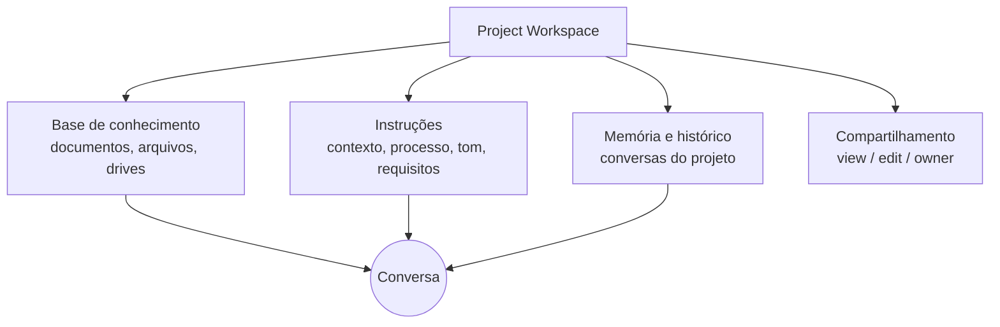

> [!abstract]
> Um **Project Workspace** é um espaço autocontido de trabalho com IA, com base de conhecimento, instruções, memória e histórico de conversas próprios — um ambiente dedicado a um fluxo de trabalho contínuo.

## Conceito

O projeto existe para eliminar o **reenvio de contexto**. Sem ele, cada nova conversa começa do zero: você recarrega os mesmos documentos, repete as mesmas preferências de tom, reexplica o mesmo domínio.

O gatilho para criar um é sempre a recorrência, em três formas:

- **Material de referência** que você usaria repetidamente — notas de reunião, pesquisas, dados históricos, templates
- **Requisitos consistentes** de como a IA deve responder — sempre citar fonte, sempre seguir um formato, sempre manter um registro de linguagem
- **Colaboração** — várias pessoas que precisam partir da mesma base

## Estrutura

## Como escala além da janela

Quando a base de conhecimento se aproxima do limite da [[Context Window]], o comportamento muda: em vez de carregar tudo em toda conversa, o sistema passa a **buscar** dentro dos arquivos e trazer só o trecho relevante à pergunta. É [[Retrieval-Augmented Generation (RAG)]] aplicado ao workspace, e amplia a capacidade em até dez vezes sem degradar a resposta.

> [!tip] O nome do arquivo é metadado
> Como a recuperação usa nome de arquivo para decidir onde buscar, `Q4-2025-Brand-Guidelines.pdf` funciona muito melhor que `documento1.pdf`. Agrupar arquivos relacionados também ajuda — a proximidade é sinal.

## Características

- **Persistente** — o conhecimento e as instruções valem para toda conversa dentro do projeto
- **Composto** — instruções do projeto operam **junto** com preferências de usuário e estilos, não no lugar delas
- **Escalável** — degrada para busca quando a base cresce
- **Colaborativo** — em planos corporativos, três níveis de permissão: *view*, *edit*, *owner*
- **Automatizável** — instruções podem funcionar como gatilho: *"quando eu subir uma transcrição, gere um resumo neste template"*

## Comparação

| | Project Workspace | [[Agent Skill\|Skill]] | Conversa avulsa |
|---|---|---|---|
| Guarda | Conhecimento (*o quê*) | Processo (*como*) | Nada além do turno |
| Escopo | As conversas do projeto | Qualquer conversa relevante | Uma conversa |
| Melhor para | Contexto de longo prazo, colaboração | Fluxo repetível | Pergunta pontual |

## Boas práticas

Começar focado e expandir depois; manter a base atualizada (documento obsoleto gera resposta obsoleta); escrever instruções específicas; nomear arquivos descritivamente; referenciar documentos pelo nome ao perguntar. Ver [[Configuração de Projeto de IA]].

## Veja também

- [[Agent Skill]]
- [[Context Window]]
- [[Retrieval-Augmented Generation (RAG)]]
- [[Agent Memory]]
- [[Enterprise Search]]
