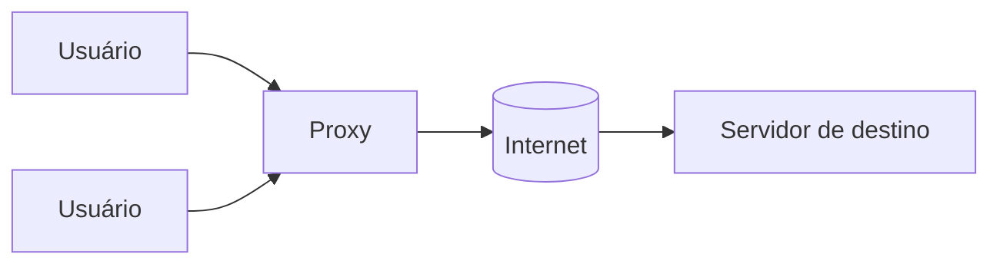

> [!abstract]
> Proxy — ou *forward proxy* — é um servidor que fica entre os **dispositivos dos usuários e a internet**, intermediando as requisições que saem.

## Conceito

O proxy direto atende ao lado do cliente. Para o servidor de destino, a requisição parece vir do proxy, não do usuário — o que muda quem é visível e quem controla o que passa.

## Para que serve

- **Proteger clientes** — esconde o IP e o perfil de quem navega
- **Contornar restrições de navegação** — sai por outra rota ou outra geografia
- **Bloquear acesso a determinado conteúdo** — filtro corporativo ou parental

> [!important] Direção é tudo
> Proxy e [[Reverse Proxy]] são o mesmo mecanismo — um intermediário que encaminha requisições — apontado para lados opostos. O proxy serve **quem faz** a requisição; o reverso serve **quem a recebe**. É a única distinção que precisa ser memorizada.

## Comparação

| | **Proxy** | **[[Reverse Proxy]]** |
|---|---|---|
| Fica ao lado de | Cliente | Servidor |
| Quem sabe que existe | O cliente (configurado nele) | Ninguém — é transparente ao cliente |
| Protege | Clientes | Servidores |
| Uso típico | Filtro corporativo, anonimato | [[Load Balancer]], cache, terminação TLS |

## Fonte

- ByteByteGo, *Proxy Vs reverse proxy* — BIG ARCHIVE: System Design 2023
- IETF, [RFC 9110 — HTTP Semantics](https://datatracker.ietf.org/doc/html/rfc9110), seção sobre intermediários

## Veja também

- [[Reverse Proxy]]
- [[API Gateway]]
- [[Modelo OSI]]
- [[Transport Layer Security (TLS)]]
- [[System Design MOC]]
