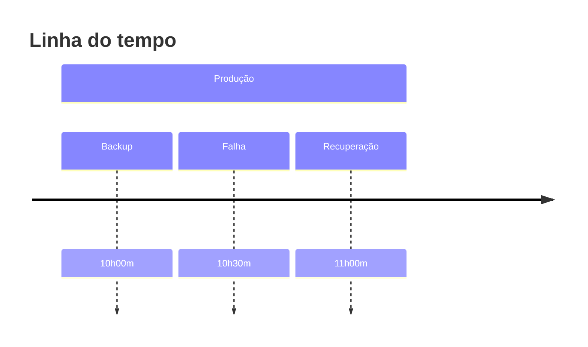

RPO define a quantidade máxima de dados que uma organização aceita perder após um incidente.

É medido em tempo.

> [!tip]
> Um RPO de 15 minutos significa que, no pior caso, até 15 minutos de dados podem ser perdidos.

## Quanto menor o RPO

- Maior custo
- Replicação mais frequente
- Melhor proteção dos dados

## Veja também

- [[RTO]]
- [[Backup]]
- [[Disaster Recovery]]