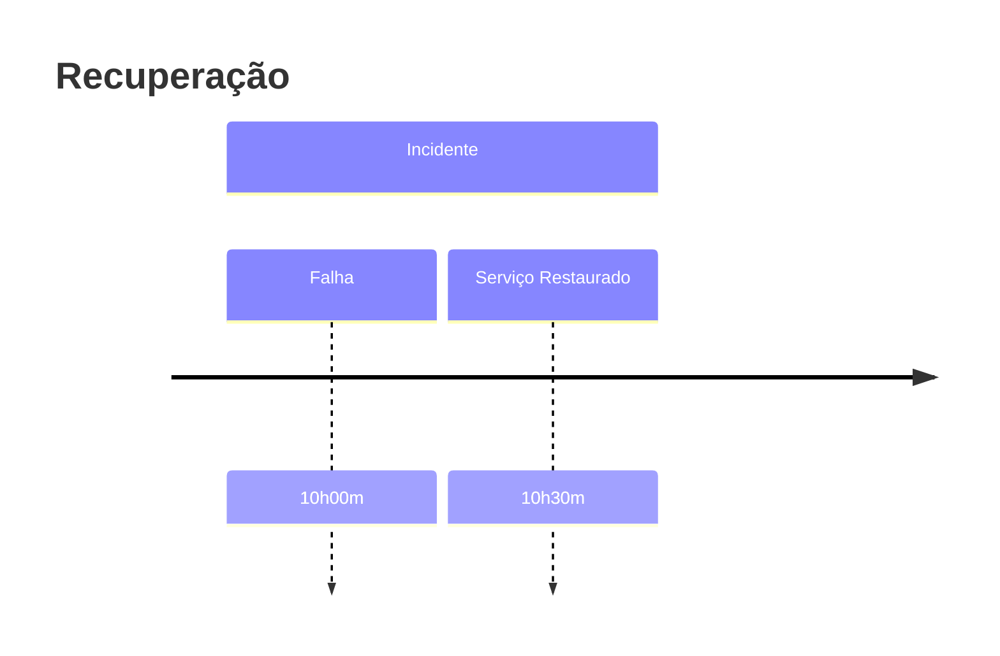

RTO representa o tempo máximo aceitável para restaurar um serviço após uma interrupção.

> [!info]
> Quanto menor o RTO, maior costuma ser o investimento em infraestrutura e automação.

## Exemplos

| Sistema | RTO |
|----------|----:|
| Banco | 5 min |
| ERP | 30 min |
| Portal institucional | 2 horas |

## Veja também

- [[RPO]]
- [[Disaster Recovery]]
- [[High Availability]]