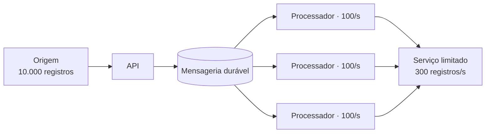

> [!abstract]
> Rate Limiting é o controle deliberado da taxa em que a aplicação envia requisições a um serviço, para permanecer dentro dos limites dele em vez de descobri-los por tentativa e erro.

## Conceito

A alternativa ingênua ao rate limiting é o *retry-on-error*: manda tudo, vê o que é rejeitado, reenvia. O custo aparece rápido.

Para ingerir 10.000 registros em um serviço que aceita 2.000 por passagem, essa abordagem envia **30.000 registros** e gera 20.000 erros — que ainda precisam ser registrados e processados, consumindo CPU, memória e armazenamento. Pior: sem conhecer o limite do serviço, não há como estimar quanto tempo o trabalho vai levar.

Com rate limiting, o volume enviado cai para os 10.000 originais e o tempo total passa a ser calculável.

## Como implementar

O padrão apoia-se em **mensageria durável**, não em buffer de memória: se a aplicação para de responder com dados em buffer, os dados se perdem. Os processadores consomem da fila no ritmo que o serviço de destino aceita.

O serviço pode limitar por diferentes métricas: número de operações (20 req/s), volume de dados (2 GiB/min) ou custo relativo da operação (20.000 RUs/s).

> [!tip] Granularidade menor que a do limite
> Se o serviço permite 100 operações por segundo, liberar **20 operações a cada 200 ms** é melhor do que 100 de uma vez no início do segundo. O consumo de memória, CPU e rede fica constante em vez de serrilhado, e o gargalo por rajada desaparece.

## Processos não coordenados

Quando vários processos independentes compartilham o mesmo serviço limitado, a capacidade pode ser **particionada logicamente** e distribuída por locks exclusivos. Um serviço com 500 req/s vira 20 partições de 25 req/s cada; o processo que precisa de capacidade adquire lock temporário sobre algumas partições e respeita a soma do que conseguiu.

## Regras

- Rate limiting **reduz**, mas não elimina, os erros de throttling — a aplicação ainda precisa tratá-los
- Coordenar rate limiting com [[Retry Pattern]]: retentativas cegas criam *retry storms*. Propagar back-pressure (HTTP `429` com `Retry-After`) e usar poucas tentativas com atraso aleatório
- Todos os fluxos que acessam o mesmo serviço devem passar pelo **mesmo mecanismo**, ou ter pools de capacidade reservados separadamente

> [!important] Rate Limiting × Throttling
> São os dois lados da mesma moeda. **Throttling** é o serviço rejeitando o excesso; **rate limiting** é o cliente se autorregulando para não ser rejeitado. O rate limiting normalmente é implementado *em resposta* a um serviço que faz throttling.

## Fonte

- Microsoft, [Rate Limiting pattern](https://learn.microsoft.com/en-us/azure/architecture/patterns/rate-limiting-pattern), Azure Architecture Center

## Veja também

- [[Retry Pattern]]
- [[Bulkhead]]
- [[API Gateway]]
- [[Message Queue]]
- [[Circuit Breaker]]
- [[System Design MOC]]
