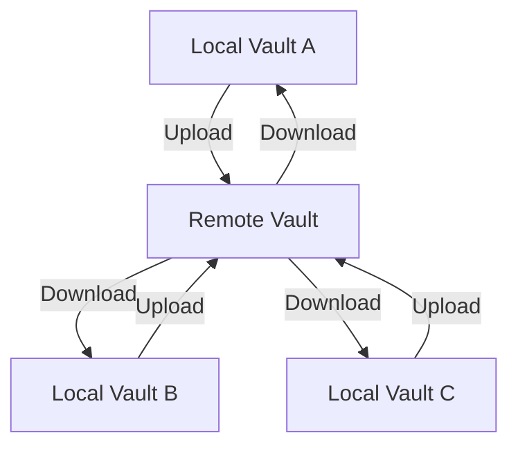

> [!abstract]
> Um **remote vault** é o armazenamento centralizado ao qual os local vaults se conectam diretamente através do [[Obsidian Sync]]; um **local vault** é a cópia do vault que existe em cada dispositivo.

## Conceito

A topologia do Sync é uma **estrela**, não uma malha. Cada local vault faz upload e download contra um único remote vault; nenhum dispositivo fala com outro. Isso é o oposto de peer-to-peer e também do modelo file-based, em que a nuvem é apenas um passthrough copiando arquivos entre pastas monitoradas.

A consequência prática é a liberdade de localização: como o remote vault é o ponto de encontro, o local vault pode viver em quase qualquer pasta de qualquer dispositivo — um HD externo, `C:\`, o App storage do Android — em vez de ficar preso à pasta de um serviço de nuvem.

A consequência de segurança é a que mais se confunde: **o local vault nunca é criptografado pelo Obsidian**. A [[End-to-End Encryption|criptografia]] se aplica ao remote vault e à comunicação com os servidores. Sua escolha entre E2EE e standard encryption "only affects your remote vault".

## Topologia

## Características

- **Sem limite por vault**: "There is no per-vault limit. The storage limit is tied to your used account" — version history e [[Attachment|attachments]] contam
- Número de remote vaults por plano: 1 no Standard, 10 no Plus. **Vaults compartilhados com você não contam** para o seu limite
- O local vault permanece plenamente funcional offline; as mudanças entram numa fila e sobem quando o dispositivo reconecta com o Obsidian aberto
- O mesmo remote vault pode receber **múltiplas [[Configuration Folder|configuration folders]]**, permitindo perfis distintos — por exemplo `.obsidian-mobile` para o celular e `.obsidian` para o laptop

## Recriar o remote vault é destrutivo

Três situações forçam a recriação: **mudar de região**, fazer **upgrade de criptografia** e **reduzir o tamanho** do vault para caber no plano.

> [!warning] Migrations are destructive
> Ao migrar um remote vault, os dados remotos são removidos dos servidores do Obsidian e reenviados no lugar. **Todo o [[Version History|version history]] do vault é perdido.** Faça [[Backup|backup]] antes.

Há uma consequência prática no downgrade de plano: attachments ficam no version history por até duas semanas e contam para o limite, então o caminho mais rápido para reduzir uso é criar um remote vault novo com attachments desabilitados — perdendo o histórico. Alternativa que preserva o resto: remover os attachments do local vault e esperar as duas semanas de purga.

## Retenção após a assinatura

- Assinatura **expirada**: os dados dos remote vaults, incluindo version history, são mantidos por **um mês**. Renovando dentro desse prazo não há impacto. Depois disso, o remote vault é removido e é preciso criar um novo e reconectar o local vault
- Assinatura **reembolsada**: os dados são **deletados imediatamente** dos servidores
- Em ambos os casos, **os local vaults nos seus dispositivos não são afetados**

## Comparação

| | Local Vault | Remote Vault |
|---|---|---|
| Onde vive | Sistema de arquivos do dispositivo | Servidor regional do Obsidian |
| Quantos | Um por dispositivo | Um por conjunto sincronizado |
| Criptografado pelo Obsidian | **Não** | **Sim**, E2EE por padrão |
| Funciona offline | Sim, integralmente | Não se aplica |
| Conta para o limite de storage | Não | Sim, com version history e attachments |
| Sobrevive ao fim da assinatura | Sim, intacto | Um mês, ou zero se houver refund |
| Guarda version history | Não — isso é [[File Recovery]], local e por dispositivo | Sim |

> [!important] A syncing service is not a backup
> A doc de setup do Sync lista, entre os pré-requisitos recomendados, ter um sistema de backup — e justifica com essa frase. O que o local vault oferece é um *soft backup*: uma cópia completa e utilizável em cada dispositivo, que sobrevive à perda do serviço. Não é o mesmo que histórico versionado e imutável.

## Veja também

- [[Vault]]
- [[Obsidian Sync]]
- [[Local-first]]
- [[Backup]]
- [[End-to-End Encryption]]
