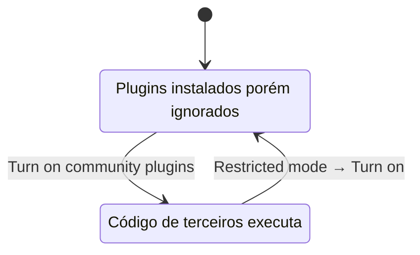

> [!abstract]
> **Restricted Mode** é o estado padrão do Obsidian que impede a execução de código de terceiros, desativando em bloco todos os community plugins instalados no vault.

## Conceito

O Restricted Mode existe porque o Obsidian não consegue conter um plugin. A doc é explícita quanto à causa: por limitações técnicas, plugins **herdam os níveis de acesso do próprio Obsidian** — podem acessar arquivos do computador, conectar-se à internet e instalar programas adicionais. Não há sandbox por permissão.

Sem granularidade possível, a única fronteira que resta é binária: ou o vault executa código de terceiros, ou não executa. O Restricted Mode é essa fronteira, e ela vem ligada por padrão.

Quando ligado, os plugins **permanecem instalados no vault, mas são ignorados** pelo Obsidian. Desligar e religar não desinstala nada — é um interruptor de execução, não de instalação. É a diferença entre uma política de [[Zero Trust]] aplicada a uma categoria inteira e uma decisão caso a caso.

## Fluxo

## Características

- Estado **padrão** de qualquer vault novo
- Desligar: Settings → Community plugins → **`Turn on community plugins`**
- Religar: Settings → Community plugins → ao lado de **Restricted mode**, `Turn on`
- É **pré-condição obrigatória** para instalar qualquer community plugin: "To install a community plugin, you must first turn off Restricted Mode"
- Controlável pelo [[Obsidian CLI]] com `plugins:restrict on` e `plugins:restrict off`
- Entrar em Restricted mode é passo de diagnóstico documentado quando um plugin impede o [[Obsidian Sync]] de confirmar o login da conta

> [!quote]
> "By default, Obsidian runs in Restricted Mode to prevent third-party code execution. Only disable Restricted mode if you trust the authors of the plugins that you install."

> [!important] O que o Restricted Mode NÃO bloqueia
> Ele governa apenas community plugins. [[Theme (Obsidian)|Themes]], [[CSS Snippet|CSS snippets]] e core plugins continuam funcionando normalmente — themes e snippets são CSS, não código executável, e os core plugins vêm do próprio Obsidian.

## Kill-switch remoto

Independente do Restricted Mode, o Obsidian consulta **a cada 12 horas a partir do horário de startup do app** um arquivo hospedado no GitHub com *plugin deprecations*. Esse arquivo permite desabilitar remotamente versões específicas de plugins conhecidas por funcionar mal, causar perda de dados ou serem vulneráveis ou maliciosas. É um mecanismo de resposta, não de prevenção — pressupõe que o problema já foi identificado depois da distribuição, o que é matéria de [[Threat Modeling]].

## Comparação

| | Restricted Mode | Desabilitar um plugin |
|---|---|---|
| Escopo | **Toda a categoria** de community plugins | Um plugin específico |
| Onde se aplica | Vault inteiro, como política | Item da lista Installed plugins |
| Estado dos arquivos | Permanecem no vault, ignorados | Permanece instalado, desligado |
| Papel | Decisão prévia de confiança | Ajuste operacional |
| Padrão | **Ligado** | Nenhum |

> [!tip]
> Para dados sensíveis, a doc recomenda auditoria de segurança independente do plugin **antes** de usá-lo — não confiar apenas no scorecard automático do Community directory.

## Veja também

- [[Obsidian Plugin]]
- [[Zero Trust]]
- [[Threat Modeling]]
- [[Obsidian CLI]]
- [[Theme (Obsidian)]]
