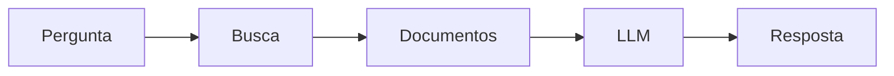

> [!abstract]
> O **Retrieval-Augmented Generation (RAG)** combina recuperação de informações com geração de linguagem por um LLM.

## Conceito

O objetivo do RAG é fornecer ao LLM informações atualizadas e relevantes antes da geração da resposta.

Em vez de depender apenas do conhecimento adquirido durante o treinamento, o modelo consulta fontes externas e incorpora esse conteúdo ao contexto da conversa.

Isso reduz alucinações e melhora a precisão das respostas.

## Fluxo

## Benefícios

- Conhecimento atualizado
- Redução de alucinações
- Maior precisão
- Uso de documentação corporativa
- Separação entre modelo e conhecimento

> [!tip]
> O RAG normalmente utiliza bancos vetoriais, mas também pode recuperar informações de bancos relacionais, APIs, sistemas corporativos ou [[Knowledge Graph]].

## Limitações

- Depende da qualidade da recuperação.
- Não representa relacionamentos complexos entre entidades.
- Pode recuperar informações redundantes.

## Veja também

- [[Large Language Model (LLM)]]
- [[Knowledge Graph]]
- [[Context Graph]]
- [[Model Context Protocol (MCP)]]
- [[Project Workspace]]
- [[Context Window]]
- [[Enterprise Search]]
