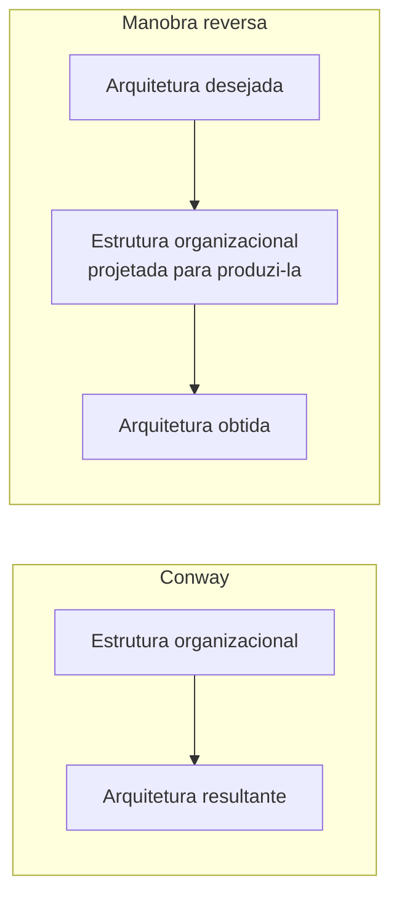

> [!abstract]
> A manobra reversa de Conway é **desenhar a organização para produzir a arquitetura desejada** — em vez de aceitar a arquitetura que a organização atual inevitavelmente produzirá.

## Conceito

A [[Lei de Conway]] observa que sistemas espelham a estrutura de comunicação de quem os constrói. Isso costuma ser tratado como curiosidade ou como lamento. A manobra reversa o trata como **alavanca**: se a estrutura determina a arquitetura, mudar a estrutura primeiro é o caminho mais direto para obter a arquitetura.

## Na prática

Uma organização com times divididos por camada — frontend, backend, banco de dados — produzirá um sistema em camadas com acoplamento entre elas, **independentemente** do que o diagrama de arquitetura diga. Toda mudança de funcionalidade atravessa três times e três filas.

Querer [[Microservices]] alinhados a domínios de negócio exige times alinhados a domínios de negócio, cada um com autonomia de ponta a ponta. Sem isso, o resultado é o monólito distribuído: serviços separados que precisam ser implantados juntos porque os times precisam se coordenar de qualquer forma.

| Estrutura de times | Arquitetura que ela produz |
|---|---|
| Por camada técnica | Sistema em camadas, mudança atravessa todos |
| Por domínio de negócio | Serviços alinhados a [[Bounded Context]] |
| Por projeto temporário | Sistemas órfãos, sem dono após a entrega |
| Time de plataforma + times de produto | Plataforma interna consumida como produto |

> [!important] É por isso que modernização técnica sozinha falha
> Fowler observa, ao tratar de [[Strangler Fig]], que sistemas legados ficam rígidos porque o pensamento de design e os processos organizacionais que os produziram eram assim. Sem mudança na cultura e na liderança, **o sistema novo termina na mesma bagunça**.

> [!warning]
> Reorganizar times é caro e disruptivo — não é uma alavanca a ser acionada sem clareza sobre a arquitetura pretendida. E a mudança de estrutura sem mudança de autonomia real não produz efeito: times renomeados que ainda dependem de aprovação externa continuam produzindo a arquitetura antiga.

## Fonte

- Thoughtworks, [Technology Radar — Inverse Conway Maneuver](https://www.thoughtworks.com/radar/techniques/inverse-conway-maneuver)
- Matthew Skelton e Manuel Pais, *Team Topologies*, IT Revolution

## Veja também

- [[Lei de Conway]]
- [[Team Topologies]]
- [[Microservices]]
- [[Bounded Context]]
- [[Strangler Fig]]
- [[Platform Engineering]]
- [[Arquitetura Evolutiva]]
