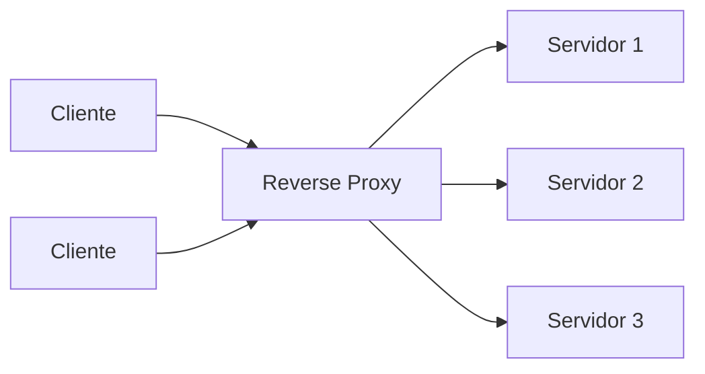

> [!abstract]
> Reverse proxy é o servidor que **recebe a requisição do cliente**, a encaminha aos servidores web internos e devolve o resultado como se ele próprio a tivesse processado.

## Conceito

Do ponto de vista do cliente, o reverse proxy **é** a aplicação: ele não sabe que existe outra coisa atrás. Essa opacidade é o que permite trocar, escalar e proteger o backend sem que o cliente perceba.

## Para que serve

| Função | O que resolve |
|---|---|
| **Proteger servidores** | O backend não é alcançável diretamente; só o proxy é exposto |
| **[[Load Balancer]]** | Distribui as requisições entre as instâncias disponíveis |
| **Cache de conteúdo estático** | Responde sem tocar no backend — ver [[Estratégias de Cache]] |
| **Terminação TLS** | Cifra e decifra em um ponto só, poupando os servidores. Ver [[Transport Layer Security (TLS)]] |
| **Compressão e reescrita** | Ajusta a resposta antes de entregá-la |

## Onde aparece no vault

O reverse proxy é o mecanismo por trás de vários componentes já documentados:

- [[Load Balancer]] — reverse proxy cuja função principal é distribuir
- [[API Gateway]] — reverse proxy que também aplica identidade, política e roteamento por rota
- [[Service Mesh]] — proxies sidecar fazendo o papel para tráfego interno entre serviços
- [[Content Delivery Network (CDN)]] — reverse proxy geograficamente distribuído

> [!important]
> Reconhecer esse padrão comum simplifica a arquitetura mental: não são cinco componentes distintos, são cinco especializações do mesmo intermediário — o que também explica por que suas funções se sobrepõem tanto na prática.

## Fonte

- ByteByteGo, *Proxy Vs reverse proxy* — BIG ARCHIVE: System Design 2023
- IETF, [RFC 9110 — HTTP Semantics](https://datatracker.ietf.org/doc/html/rfc9110)

## Veja também

- [[Proxy]]
- [[Load Balancer]]
- [[API Gateway]]
- [[Service Mesh]]
- [[Content Delivery Network (CDN)]]
- [[System Design MOC]]
