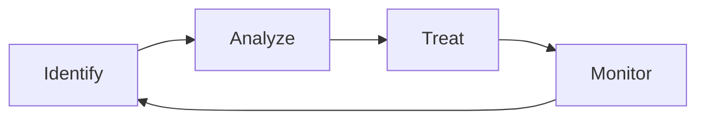

Risk Management é o processo contínuo de identificar, analisar, tratar e monitorar riscos que possam impactar os objetivos de um sistema ou organização.

> [!info]
> Todo risco possui uma probabilidade de ocorrência e um impacto associado.

## Estratégias

- Evitar
- Mitigar
- Transferir
- Aceitar

## Exemplos

- Falha de datacenter
- Vazamento de dados
- Ataques DDoS
- Erro humano

## Veja também

- [[Business Continuity]]
- [[Disaster Recovery]]
- [[Threat Modeling]]