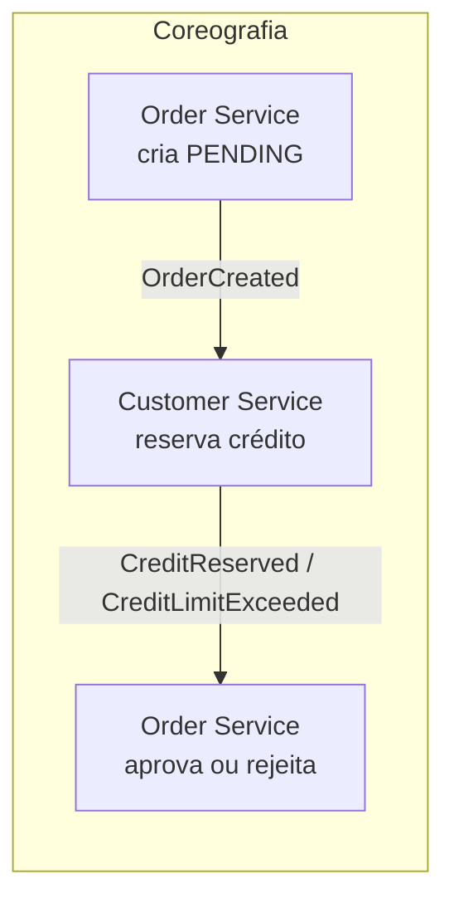
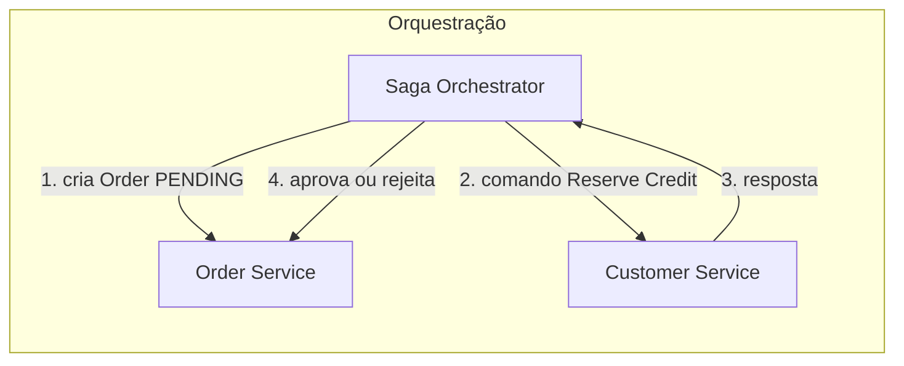

> [!abstract]
> Saga implementa uma transação que atravessa vários serviços como uma **sequência de transações locais**, cada uma disparando a próxima por mensagem ou evento — e desfeita, quando falha, por transações compensatórias.

## Conceito

Ao adotar *database per service*, cada serviço passa a ter sua própria base. Transações de negócio que cruzam serviços deixam de poder usar uma transação ACID local: um pedido que precisa respeitar o limite de crédito do cliente tem `Order` e `Customer` em bancos diferentes, sob donos diferentes.

E [[Two-Phase Commit]] não é opção. Restam as sagas.

Cada passo da saga atualiza a base do seu serviço e publica um evento ou mensagem que dispara o passo seguinte. Se um passo viola uma regra de negócio, a saga executa **transações compensatórias** que desfazem, uma a uma, as mudanças dos passos anteriores.

## Coreografia × Orquestração

| | **Coreografia** | **Orquestração** |
|---|---|---|
| Quem coordena | Ninguém — cada serviço reage a [[Domain Events]] | Um orquestrador envia comandos |
| Acoplamento | Menor | Maior, concentrado no orquestrador |
| Visibilidade do fluxo | Implícita, difícil de acompanhar | Explícita, em um lugar só |
| Adequação | Sagas curtas | Sagas longas ou com muitos ramos |

## Custos

> [!warning] Não existe rollback automático
> A ACID devolve o rollback de graça. Na saga, **o desenvolvedor projeta cada transação compensatória à mão** — e desfazer nem sempre é simétrico: cancelar um envio já despachado não é o inverso de despachá-lo.

> [!warning] Não existe isolamento
> O "I" do ACID não sobrevive. Sagas concorrentes leem estados intermediários umas das outras e produzem anomalias de dados. Contorná-las exige *countermeasures* — técnicas de projeto que reintroduzem isolamento — escolhidas com análise cuidadosa caso a caso.

## A questão da atomicidade local

Cada passo precisa atualizar a base **e** publicar a mensagem de forma atômica, sem 2PC entre banco e broker. As duas soluções conhecidas são [[Outbox Pattern]] e [[Event Sourcing]].

## Respondendo ao cliente

Uma saga é assíncrona, mas o cliente que a iniciou com `POST /orders` espera um desfecho. Três opções, com trade-offs distintos:

- Responder só quando a saga terminar
- Responder o `orderID` e deixar o cliente consultar `GET /orders/{id}` periodicamente
- Responder o `orderID` e notificar por websocket ou webhook ao concluir

## Fonte

- Chris Richardson, [Pattern: Saga](https://microservices.io/patterns/data/saga.html), microservices.io
- Chris Richardson, *Microservices Patterns*, cap. 4, Manning

## Veja também

- [[Two-Phase Commit]]
- [[Outbox Pattern]]
- [[Event Sourcing]]
- [[Domain Events]]
- [[Idempotência]]
- [[Microservices]]
- [[Eventual Consistency]]
- [[System Design MOC]]
