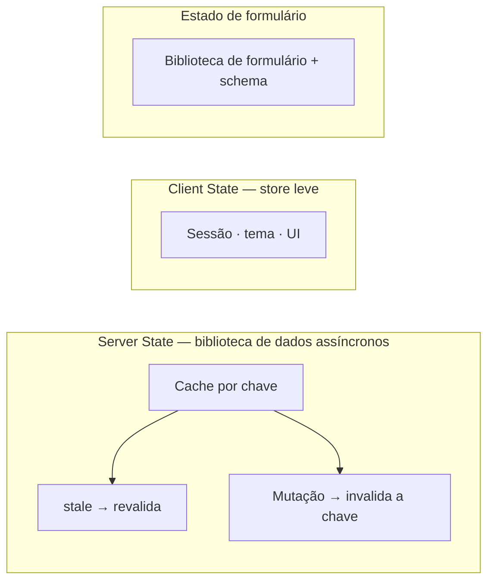

> [!abstract]
> Estado de servidor é a cópia local de um dado cuja verdade vive remotamente; estado de cliente é o dado que nasce e morre no navegador. Confundir os dois é a origem da maior parte da complexidade acidental no frontend.

## Conceito

A distinção não é acadêmica — os dois tipos têm propriedades **opostas**:

| | **Server State** | **Client State** |
|---|---|---|
| Dono da verdade | O backend | O navegador |
| Pode ficar obsoleto | Sim, a qualquer momento | Não |
| Assíncrono | Sempre | Nunca |
| Compartilhado | Sim, com outros usuários | Não |
| Precisa de cache, revalidação, retry | Sim | Não |
| Exemplos | Lista de pedidos, perfil, notificações | Sidebar aberta, tema, passo do formulário, filtro em edição |

Guardar server state em um store global de cliente obriga a reimplementar à mão tudo aquilo que ele exige: cache com expiração, deduplicação de requisições simultâneas, revalidação ao focar a janela, retry com backoff, estado de carregamento e de erro por consulta. É reescrever uma biblioteca inteira, mal, dentro do reducer.



## Chave de consulta é contrato

Em uma biblioteca de server state, o cache é indexado por uma chave estruturada. Quando ela é escrita como string solta em cada componente, a invalidação erra silenciosamente — o dado muda no servidor e a tela não atualiza. O padrão que elimina a classe inteira de bugs é a **fábrica de chaves**: um objeto único por domínio que deriva todas as chaves hierarquicamente, de modo que invalidar o nível superior invalida tudo abaixo.

```ts
export const pedidoKeys = {
  all:     ['pedido'] as const,
  lists:   () => [...pedidoKeys.all, 'list'] as const,
  list:    (f: Filtros) => [...pedidoKeys.lists(), f] as const,
  detail:  (id: string) => [...pedidoKeys.all, 'detail', id] as const,
};
```

## Consequências de projeto

- **Evento em tempo real não carrega dado, carrega notícia.** A mensagem do [[WebSocket]] deve invalidar a chave correspondente e deixar a biblioteca refazer a busca — reconstruir o objeto a partir do payload do evento cria uma segunda fonte de verdade que diverge
- **Ao encerrar a sessão, limpe o cache de servidor**, não só o store de sessão. Dado do usuário anterior visível para o próximo é vazamento
- Formulário é uma terceira categoria: estado efêmero e de altíssima frequência de atualização, que pertence a uma biblioteca de formulário, não ao store global

> [!warning] `useEffect` + `fetch` para dado remoto
> Funciona na primeira tela e falha em todas as outras: sem deduplicação, sem cache, sem cancelamento na desmontagem, com *race condition* entre respostas fora de ordem. Toda leitura remota passa pela camada de server state.

## Veja também

- [[Feature-Sliced Architecture]]
- [[Estratégias de Cache]]
- [[CQRS]]
- [[Eventual Consistency]]
