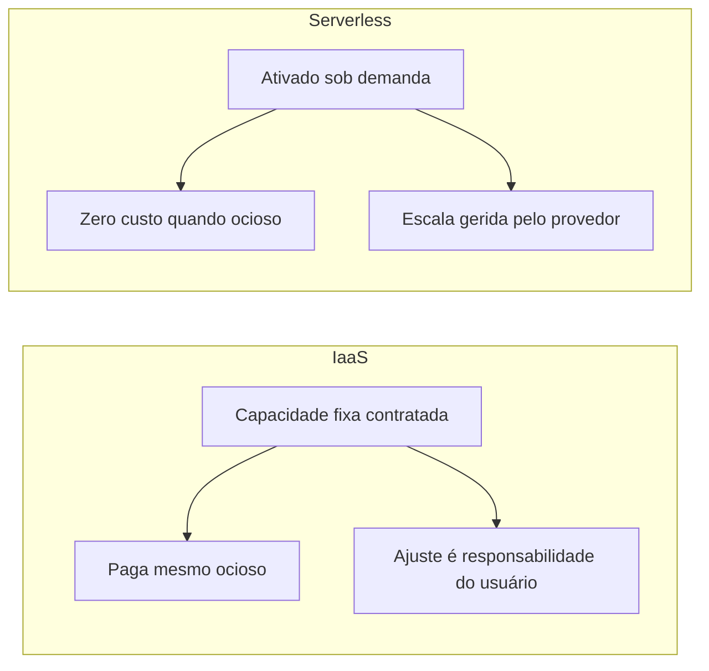

> [!abstract]
> Serverless é o modelo em que o servidor é abstraído do usuário: o provedor assume toda a gestão operacional, o escalonamento é automático conforme a demanda e a cobrança é por uso.

## Conceito

O nome engana — servidores continuam existindo. O que desaparece é a **responsabilidade** sobre eles: máquinas físicas, provisionamento de VMs, manutenção de sistema operacional, atualizações de segurança, balanceamento de carga, planejamento de capacidade e monitoramento passam todos para o provedor.

O provedor pode ser uma nuvem pública ou o próprio departamento de TI servindo seus times de desenvolvimento. A interface oferecida é SDK, CLI ou runtime compatível com OCI, e o foco de quem usa fica em código e implantação.

## O problema que resolve

No modelo [[Cloud Native|IaaS]] tradicional, o usuário se compromete com uma capacidade predefinida e paga pela disponibilidade contínua do servidor, **independentemente do uso real**. Ajustar essa capacidade à demanda variável é problema dele, e a infraestrutura permanece ativa mesmo nos períodos ociosos.

## Características

- **Pay-per-use**: cobrança pelo consumo efetivo, não pela reserva
- **Escala automática** de computação, armazenamento e rede, sem intervenção
- **Multitenancy**: o provedor consolida recursos de vários usuários na mesma máquina física, isolando por virtualização
- É um **termo guarda-chuva** que abrange serviços com esses atributos, do PaaS ao SaaS

> [!important] Serverless ≠ FaaS
> Os termos são usados de forma intercambiável, mas não são a mesma coisa. **FaaS** (Function as a Service) é um modelo específico de execução de funções sob demanda; **serverless** é a categoria mais ampla de serviços que abstraem o servidor — bancos, filas e armazenamento serverless também qualificam.

> [!info] O último eixo da adoção
> Serverless é o sexto dos eixos de [[Adoção Cloud Native]]. Adotá-lo antes dos anteriores — definição da aplicação, orquestração, runtime, provisionamento e observabilidade — transfere complexidade em vez de eliminá-la: uma arquitetura serverless sem [[Distributed Tracing]] é praticamente indiagnosticável.

## Fonte

- CNCF, [Serverless](https://glossary.cncf.io/serverless/), Cloud Native Glossary

## Veja também

- [[Cloud Native]]
- [[Adoção Cloud Native]]
- [[Container]]
- [[Immutable Infrastructure]]
- [[Cloud Native Anti-Patterns]]
- [[Microservices]]
- [[Cold Start]]
- [[AWS Lambda]]
- [[AWS Serverless Architecture MOC]]
- [[System Design MOC]]
