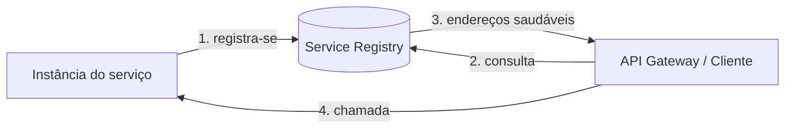

> [!abstract]
> Service Discovery é o mecanismo pelo qual um serviço descobre, em tempo de execução, o endereço das instâncias com as quais precisa se comunicar.

## Conceito

Em um ambiente elástico, instâncias nascem, morrem e mudam de endereço o tempo todo — é exatamente o comportamento desejado em contêineres e autoescala. Endereços fixos em configuração deixam de funcionar nesse regime, e a resposta é inverter a lógica: cada instância **se registra** ao subir, e quem precisa dela **consulta o registro**.

## Fluxo

## Características

- O registro mantém *health checks*: instância que não responde é removida do conjunto elegível
- **Client-side discovery** — o cliente consulta o registro e escolhe a instância
- **Server-side discovery** — um intermediário (gateway, balanceador, [[Service Mesh]]) consulta por ele
- Em [[Kubernetes (K8s)]] a função é nativa: o recurso Service e o DNS interno do cluster fazem esse papel

> [!important]
> Service Discovery e [[Load Balancer]] resolvem perguntas diferentes que costumam ser confundidas: descoberta responde *quais instâncias existem*; balanceamento responde *qual delas recebe esta requisição*.

## Veja também

- [[Microservices]]
- [[API Gateway]]
- [[Service Mesh]]
- [[Kubernetes (K8s)]]
- [[Load Balancer]]
