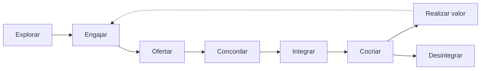

> [!abstract]
> Service Journey é o caminho completo percorrido pelo consumidor ao longo da relação de serviço, do primeiro contato até a saída.

## Conceito

A jornada de serviço é mais ampla que a jornada de uso: inclui descobrir, contratar, ser integrado, usar, pedir ajuda, renovar e eventualmente sair. Boa parte do atrito real de um serviço mora nas etapas que ninguém instrumenta — onboarding e offboarding.

Olhar a jornada inteira também revela que a percepção de qualidade se forma nos momentos de exceção, não nos de operação normal.

## Estrutura

## Características

- Cobre toda a relação, não apenas o uso
- Momentos de exceção pesam mais na percepção que a rotina
- Conecta [[Customer Experience (CX)]] a decisões operacionais
- Insumo para [[Value Stream Mapping]]

## Veja também

- [[Service Relationship]]
- [[Customer Experience (CX)]]
- [[Jornadas do Usuário]]
- [[Value Stream Mapping]]
