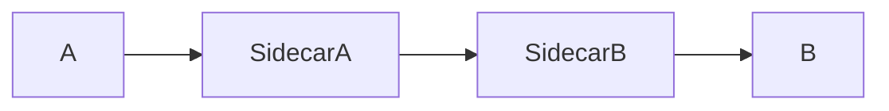

Service Mesh é uma camada de infraestrutura responsável pela comunicação entre microsserviços.

Ela adiciona funcionalidades sem alterar o código das aplicações.

> [!info]
> O Service Mesh utiliza proxies sidecar para controlar o tráfego entre serviços.

## Funcionalidades

- mTLS
- Retry
- Circuit Breaker
- Load Balancing
- Observabilidade
- Rate Limiting

## Exemplos

- Istio
- Linkerd
- Consul Connect

## Veja também

- [[Microservices]]
- [[Sidecar Pattern]]
- [[Circuit Breaker]]