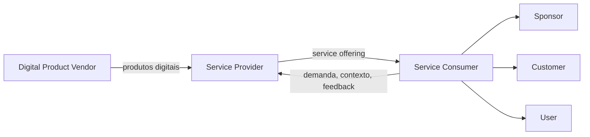

> [!abstract]
> O ITIL Service Relationship Model é o modelo, introduzido na Versão 5, que representa os papéis e fluxos entre provedor, consumidor e fornecedores de produto digital numa relação de serviço.

## Conceito

O modelo torna explícito algo que a v4 tratava de forma difusa: quase nenhuma organização é provedor puro. Ela consome produtos digitais de terceiros, os compõe, e provê serviços a partir dessa composição. O [[Digital Product Vendor]] entra no modelo como papel de primeira classe.

Isso reposiciona a gestão de fornecedores: ela deixa de ser função de compras e passa a ser parte da arquitetura do serviço.

## Estrutura

## Características

- Reconhece a cadeia provedor–fornecedor como parte do serviço
- Separa os papéis do lado consumidor: [[Sponsor]], [[Customer]], [[User]]
- Torna visível onde risco e dependência realmente residem
- Novo na Versão 5

## Veja também

- [[Service Relationship]]
- [[Digital Product Vendor]]
- [[Service Provider]]
- [[Service Consumer]]
- [[Supplier Management]]
