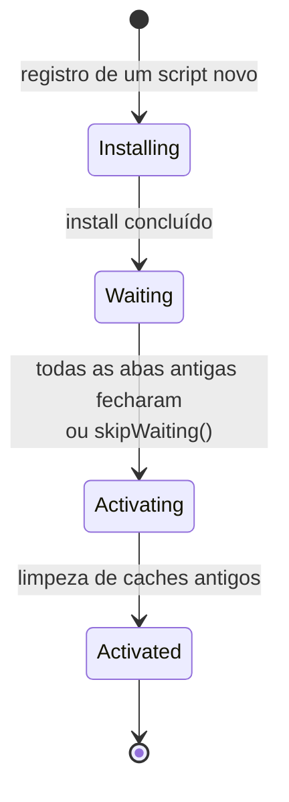

> [!abstract]
> Service worker é um script que roda em segundo plano, fora da página, e intercepta as requisições de rede da aplicação — funcionando como um proxy programável no próprio dispositivo do usuário.

## Conceito

É o que torna a [[Progressive Web App (PWA)]] possível. Diferente de qualquer script da página, o service worker:

- Tem **ciclo de vida independente** da aba — continua vivo para receber push e eventos de sincronização mesmo com a aplicação fechada
- **Não tem acesso ao DOM** — comunica-se com as páginas por mensagens
- É **orientado a eventos**: acorda, trata o evento, e é encerrado. Nenhum estado em memória sobrevive entre ativações; a persistência é em Cache Storage ou IndexedDB

## Ciclo de vida — a fonte de quase todo bug

O estado **waiting** é o que surpreende: um deploy novo não substitui o worker antigo enquanto houver aba aberta com o anterior. Recarregar a página não basta — a navegação mantém o cliente vivo. Por isso o padrão correto é detectar a versão nova e **oferecer ao usuário** o recarregamento:

> [!important] Atualização precisa ser visível e consentida
> Chamar `skipWaiting()` sem avisar troca o worker sob os pés de uma aba em uso, e a página passa a conversar com uma versão de assets diferente da que carregou. O padrão seguro é um aviso na interface: *"nova versão disponível — recarregar"*.

## Eventos que importam

| Evento | Uso |
|---|---|
| `install` | Pré-cachear o app shell |
| `activate` | Apagar caches de versões anteriores |
| `fetch` | Aplicar a estratégia de cache por tipo de recurso |
| `push` | Receber [[Web Push]] e exibir a notificação |
| `sync` | Reenviar mutações que falharam offline (Background Sync) |

## Armadilhas

- **Escopo**: o worker só intercepta requisições no caminho a partir de onde foi servido. Publicado em `/js/sw.js`, ele não controla `/`
- **Cachear `index.html` agressivamente** congela a aplicação numa versão antiga — é o par simétrico da política de CDN descrita em [[Amazon CloudFront]]
- **Cachear resposta de API sem critério** faz o usuário ver dado obsoleto sem saber
- Em desenvolvimento, um worker registrado serve conteúdo velho e simula bugs que não existem — desregistrar é o primeiro passo de qualquer diagnóstico estranho

## Veja também

- [[Progressive Web App (PWA)]]
- [[Estratégias de Cache em PWA]]
- [[Web Push]]
- [[Estratégias de Cache]]
