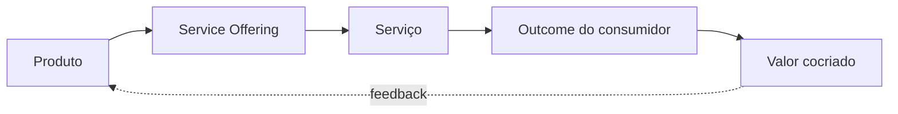

> [!abstract]
> Serviço é um meio de habilitar a cocriação de valor, facilitando resultados que o consumidor quer alcançar sem que ele precise gerenciar os custos e riscos específicos envolvidos.

## Conceito

A definição carrega três compromissos. O serviço **facilita resultados**, não entrega saídas. Ele **remove custos e riscos específicos** do consumidor — não todos, apenas aqueles que o provedor absorve melhor. E ele existe para **cocriação**: sem participação do consumidor, não há valor.

É por isso que serviço não é sinônimo de sistema. Um sistema que ninguém usa não é serviço; é infraestrutura ociosa.

## Estrutura

## Características

- Facilita resultados ([[Outcome]]), não apenas saídas ([[Output]])
- Transfere custos e riscos específicos para o provedor
- É consumido, não possuído
- Só gera valor em relação — exige [[Service Relationship]]

## Veja também

- [[Product]]
- [[Digital Service]]
- [[Service Offering]]
- [[Value Co-Creation]]
- [[Utility]]
- [[Warranty]]
