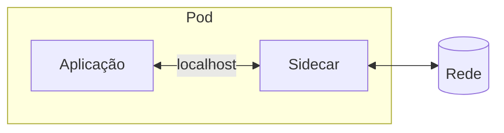

> [!abstract]
> Sidecar é o padrão de implantar funcionalidade de apoio em um **processo ou contêiner separado**, anexado à aplicação principal — como o sidecar de uma motocicleta: acompanha, mas tem casco próprio.

## Conceito

Toda aplicação precisa de coisas que não são o seu domínio: telemetria, configuração, TLS, retentativa, descoberta. Embutir isso na aplicação significa reimplementar em cada linguagem e reimplantar a aplicação a cada mudança da biblioteca.

O sidecar tira essa camada de dentro do processo e a coloca ao lado, compartilhando o ciclo de vida e os recursos — mesmo Pod, mesma rede local, mesmo armazenamento.

## Características

- **Independente de linguagem**: o sidecar é escrito uma vez e serve a qualquer aplicação
- **Isolamento de falha parcial**: o sidecar pode falhar sem levar a aplicação junto — é [[Bulkhead]] no nível do processo
- **Atualização desacoplada**: trocar o sidecar não exige recompilar a aplicação
- **Latência mínima**: a comunicação é local, não atravessa a rede

## Onde aparece

| Uso | Exemplo |
|---|---|
| Malha de serviços | [[Service Mesh]] — o proxy sidecar intercepta todo o tráfego e aplica mTLS, retry e [[Circuit Breaker]] |
| Observabilidade | Coletor de log e de métrica ao lado da aplicação. Ver [[Logging]] |
| Configuração | Sincroniza segredos e configuração sem reiniciar a aplicação |
| Proxy de saída | Variante *ambassador*: o sidecar fala com o mundo externo em nome da aplicação |

> [!warning] O custo é multiplicado pela escala
> Um sidecar por instância significa que 500 pods carregam 500 sidecars, cada um consumindo CPU e memória. Em malhas grandes, o custo do plano de dados chega a rivalizar com o da própria aplicação — motivo pelo qual surgiram modos sem sidecar (*ambient mesh*), que movem a função para o nó.

> [!important]
> Sidecar e [[Reverse Proxy]] são o mesmo mecanismo em escopos diferentes: o reverse proxy intermedeia o tráfego de muitos clientes para muitos servidores; o sidecar intermedeia o de **uma** instância. É a razão de a lista de funções dos dois ser quase idêntica.

## Fonte

- Microsoft, [Sidecar pattern](https://learn.microsoft.com/en-us/azure/architecture/patterns/sidecar), Azure Architecture Center

## Veja também

- [[Service Mesh]]
- [[Reverse Proxy]]
- [[Container]]
- [[Kubernetes (K8s)]]
- [[Bulkhead]]
- [[Microservices]]
- [[System Design MOC]]
