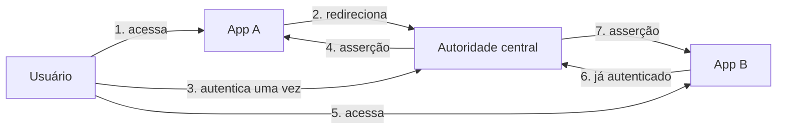

> [!abstract]
> Single Sign-On é o arranjo em que o usuário se autentica **uma vez** junto a uma autoridade central e obtém acesso a vários sistemas, sem repetir o login em cada um.

## Conceito

Gestão de identidade tem três perguntas em sequência: quem você diz que é (**identificação**), como se prova (**autenticação**) e o que pode fazer (**autorização**). SSO ataca a segunda: centralizá-la em um serviço de autenticação evita que cada sistema mantenha suas próprias senhas.

## A escala de soluções

O SSO é um degrau em uma escala que vai do mais simples ao mais completo:

| Mecanismo | Como funciona | Limitação |
|---|---|---|
| **WWW-Authenticate** | O navegador pede usuário e senha | Sem controle do ciclo de vida do login — praticamente extinto |
| **Sessão + cookie** | O servidor guarda a sessão, o navegador guarda o ID | Amarrado ao navegador; ruim para app mobile |
| **Token** | O cliente envia um token que o servidor valida | Custo de cifrar e decifrar a cada requisição |
| **[[JSON Web Token (JWT)]]** | Token padronizado e assinado | Dispensa estado no servidor, mas revogar é difícil |
| **SSO** | Autenticação centralizada (CAS) mantém a informação entre sites | Concentra risco na autoridade central |
| **[[OAuth 2.0]]** | Autoriza um site a acessar seus dados em outro | Autoriza, não autentica |

## Protocolos

- **SAML** — asserções em XML, dominante em ambiente corporativo
- **OpenID Connect** — camada de identidade sobre [[OAuth 2.0]], padrão para web e mobile modernos
- **Kerberos** — SSO em rede interna, base do Active Directory

> [!warning] O ponto único de falha é duplo
> Se a autoridade central cai, **nenhum** sistema autentica. Se ela é comprometida, o atacante alcança **todos**. Centralizar identidade concentra tanto o benefício quanto o risco — daí a exigência de MFA e monitoramento reforçado nesse componente específico.

> [!important] SSO ≠ [[Identity Federation]]
> SSO é sobre **não repetir o login** dentro de um domínio de confiança. Federação é sobre **estabelecer confiança entre domínios distintos** — a empresa A aceitar identidades emitidas pela empresa B. A federação normalmente entrega SSO como consequência, mas os problemas que resolvem são diferentes.

## Fonte

- ByteByteGo, *Session, cookie, JWT, token, SSO, and OAuth 2.0* — BIG ARCHIVE: System Design 2023
- OWASP, [SAML Security Cheat Sheet](https://cheatsheetseries.owasp.org/cheatsheets/SAML_Security_Cheat_Sheet.html)

## Veja também

- [[OAuth 2.0]]
- [[JSON Web Token (JWT)]]
- [[Identity Federation]]
- [[Gerenciamento de Sessão]]
- [[Segurança de API]]
- [[System Design MOC]]
