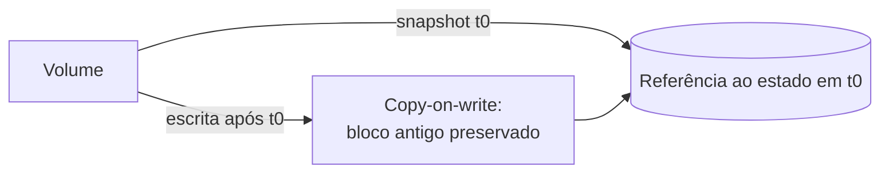

> [!abstract]
> Snapshot é uma cópia **consistente de um ponto no tempo** de um volume ou base de dados, tipicamente criada por *copy-on-write* — sem duplicar os dados que não mudaram.

## Conceito

Copiar um volume grande enquanto ele está em uso é lento e produz uma cópia inconsistente: os primeiros blocos foram lidos num instante e os últimos, em outro. O snapshot resolve congelando o estado lógico e registrando apenas as **mudanças posteriores**.

O primeiro snapshot é completo; os seguintes são **incrementais**, guardando só os blocos alterados desde o anterior.

## Snapshot × Backup

| | **Snapshot** | **[[Backup]]** |
|---|---|---|
| Velocidade de criação | Segundos | Minutos a horas |
| Onde vive | Frequentemente acoplado ao armazenamento de origem | Destino separado e independente |
| Retenção | Curta, operacional | Longa, com política |
| Sobrevive à perda da origem? | **Nem sempre** | Sim, por definição |
| Uso típico | Reverter uma mudança que deu errado | Recuperar de desastre |

> [!warning] Snapshot não é backup
> É a confusão mais cara na operação de infraestrutura. Um snapshot que compartilha o mesmo sistema de armazenamento da origem morre junto com ele. Ele reduz o [[RPO]] para incidentes operacionais — deploy ruim, alteração equivocada — mas não substitui uma cópia isolada para [[Disaster Recovery]].

> [!important] Consistência de aplicação
> Congelar os blocos do disco não congela o que está em memória. Um snapshot de um banco de dados com escritas em voo pode capturar um estado que a aplicação nunca produziria. É por isso que se usa *quiesce* — o banco descarrega e pausa as escritas por um instante antes do snapshot.

## Usos além da recuperação

- **Clonar ambiente** — criar staging a partir de produção em segundos
- **Base de imagem** — snapshot vira template de instância, ligando o conceito a [[Immutable Infrastructure]]
- **Migração** — copiar o snapshot para outra região ou conta

## Fonte

- Amazon Web Services, [Amazon EBS Snapshots](https://docs.aws.amazon.com/ebs/latest/userguide/ebs-snapshots.html)

## Veja também

- [[Backup]]
- [[Disaster Recovery]]
- [[RPO]]
- [[Block Storage]]
- [[Immutable Infrastructure]]
- [[Failover]]
