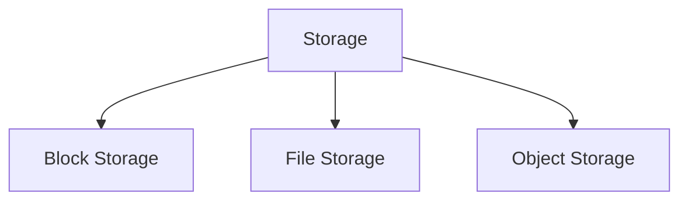

Storage é a infraestrutura responsável por armazenar, organizar e disponibilizar dados de forma persistente para aplicações e usuários.

Os sistemas modernos oferecem diferentes modelos de armazenamento, cada um otimizado para necessidades específicas de desempenho, escalabilidade e acesso.

> [!info]
> A escolha do tipo de armazenamento depende do padrão de acesso aos dados, dos requisitos de desempenho e da escalabilidade esperada.

## Principais tipos

- Block Storage
- File Storage
- Object Storage

## Critérios de escolha

- Latência
- Throughput
- IOPS
- Escalabilidade
- Durabilidade
- Compartilhamento
- Custo

## Exemplos

| Tipo | Casos de uso |
|-------|--------------|
| Block | Bancos de dados, máquinas virtuais |
| File | Compartilhamento de arquivos |
| Object | Backup, Data Lake, mídia, logs |

## Veja também

- [[Block Storage]]
- [[File Storage]]
- [[Object Storage]]
- [[Data Lake]]
- [[Backup]]