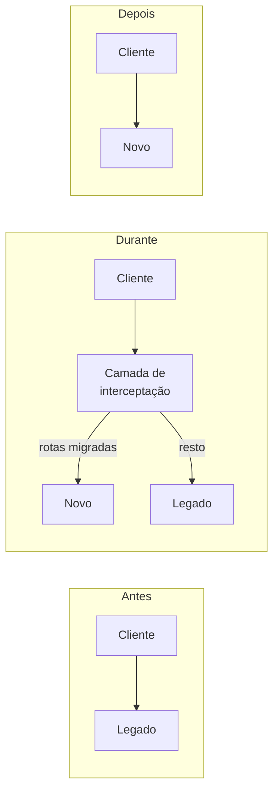

> [!abstract]
> Strangler Fig é a abordagem de modernizar um sistema legado **gradualmente**, retirando comportamento dele pouco a pouco, em vez de substituí-lo de uma vez.

## Conceito

A metáfora vem das figueiras estranguladoras da floresta australiana: a planta germina numa fenda da árvore hospedeira, cresce extraindo nutrientes dela até alcançar o solo com raízes próprias e a copa com sol próprio. Torna-se autossuficiente, e a árvore original pode morrer, deixando a figueira como eco de sua forma.

Diante de um legado impossível de continuar remendando, é fácil pensar em substituição simples: sabemos o que o sistema faz, então construímos um novo que faça o mesmo em tecnologia melhor.

> [!warning] Esse plano falha na maior parte das vezes
> Substituir um sistema sério **leva muito tempo**, e os usuários não conseguem esperar por funcionalidades novas nesse intervalo. Substituições parecem fáceis de especificar, mas descobrir os detalhes do comportamento existente é difícil. Pior: boa parte desse comportamento é indesejada — construí-la de novo é desperdício.

## Dinâmica

Cartwright, Horn e Lewis definem quatro atividades — sem implicar sequência:

1. **Entender os resultados desejados.** Objetivos confusos, com grupos querendo coisas diferentes, são o padrão. O alinhamento precisa ser estabelecido cedo e revisitado
2. **Decidir como quebrar o problema em partes menores.** Identificar as *costuras* (seams) que permitem separar o sistema
3. **Entregar as partes com sucesso.** Componentes pequenos carregam pouco risco, geram valor cedo e ensinam sobre a substituição seguinte
4. **Mudar a organização** para que isso continue acontecendo

## Regras

- **Aceitar a arquitetura de transição.** O código que permite novo e legado coexistirem será descartado ao fim — parece desperdício, mas o risco reduzido e o valor antecipado compensam
- **Modernizar sem mudar a organização repete o problema.** Sistemas legados ficam rígidos porque o pensamento de design e os processos que os produziram eram assim. Ver [[Lei de Conway]] e [[Reverse Conway Maneuver]]
- **Costuras raramente existem prontas.** Em um sistema bem projetado elas já estariam lá — e esses sistemas, nas palavras de Fowler, são unicórnios

> [!tip]
> É o caminho natural para sair de um monólito em direção a [[Microservices]] ou para substituir integrações [[SOAP]] legadas — cada [[Bounded Context]] identificado vira um candidato a costura.

## Fonte

- Martin Fowler, [Strangler Fig](https://martinfowler.com/bliki/StranglerFigApplication.html), 2024
- Ian Cartwright, Rob Horn e James Lewis, [Patterns of Legacy Displacement](https://martinfowler.com/articles/patterns-legacy-displacement/)

## Veja também

- [[Microservices]]
- [[Bounded Context]]
- [[Lei de Conway]]
- [[Arquitetura Evolutiva]]
- [[Domain Driven Design]]
- [[API Gateway]]
- [[System Design MOC]]
