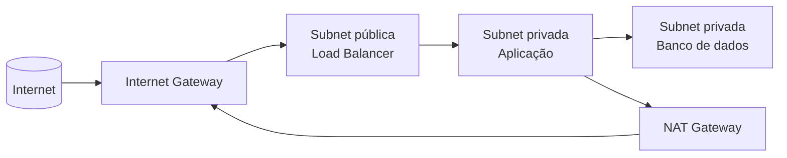

> [!abstract]
> Subnet é uma **faixa de endereços IP dentro de uma rede maior** — o mecanismo que divide uma [[Virtual Private Cloud (VPC)]] em compartimentos com regras de acesso próprias.

## Conceito

Uma VPC com um único espaço plano coloca banco de dados e servidor web na mesma vizinhança lógica. A subnet é o que permite separá-los: cada uma recebe um pedaço do bloco [[CIDR]] da VPC, uma tabela de rotas e regras de tráfego próprias.

Em nuvem, a subnet vive em **uma única zona de disponibilidade** — o que a torna também a unidade de distribuição geográfica.

## Pública × privada

A distinção não é uma propriedade da subnet, é consequência da **rota**:

| | **Subnet pública** | **Subnet privada** |
|---|---|---|
| Rota para o Internet Gateway | Sim | Não |
| Recebe conexão da internet | Sim | Não |
| Sai para a internet | Direto | Via NAT Gateway |
| Hospeda tipicamente | [[Load Balancer]], bastion | Aplicação, banco, cache |

## Por que segmentar

- **Isolamento de falha e de comprometimento** — é [[Bulkhead]] aplicado à camada de rede: quem alcança a subnet pública não alcança o banco
- **Alta disponibilidade** — subnets em zonas diferentes permitem sobreviver à perda de uma delas. Ver [[High Availability]]
- **Conformidade** — segmentar é requisito explícito de vários regimes de [[Compliance]]

> [!important] Segmentar rede é decisão de segurança antes de ser de rede
> A subnet privada não impede um ataque; impede que ele alcance o alvo diretamente. É o mesmo raciocínio de compartimentação que [[Bulkhead]] aplica a pools de conexão, um nível abaixo.

## Fonte

- Amazon Web Services, [Configure subnets for your VPC](https://docs.aws.amazon.com/vpc/latest/userguide/configure-subnets.html)
- IETF, [RFC 1918 — Address Allocation for Private Internets](https://datatracker.ietf.org/doc/html/rfc1918)

## Veja também

- [[Virtual Private Cloud (VPC)]]
- [[CIDR]]
- [[Bulkhead]]
- [[High Availability]]
- [[Load Balancer]]
- [[System Design MOC]]
