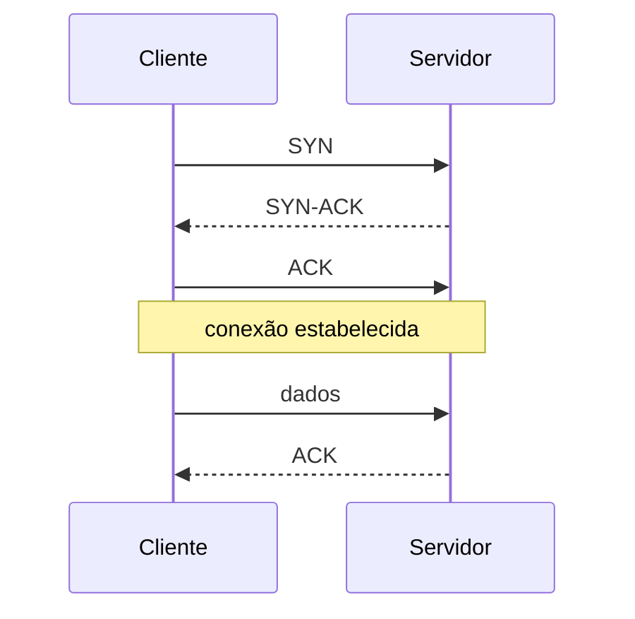

> [!abstract]
> TCP é o protocolo de transporte que entrega um **fluxo de bytes confiável e ordenado** entre dois processos, sobre uma rede que não garante nada disso.

## Conceito

A camada de rede (IP) faz o melhor esforço: o pacote pode se perder, chegar duplicado, chegar fora de ordem ou nunca chegar. TCP constrói, em cima dessa base pouco confiável, a abstração que a maioria das aplicações espera — uma conexão em que o que foi enviado chega, inteiro e na ordem certa.

Isso custa: conexão a estabelecer, estado a manter dos dois lados e retransmissões que introduzem latência.

## Como entrega a garantia

| Mecanismo | O que resolve |
|---|---|
| **Three-way handshake** (`SYN` → `SYN-ACK` → `ACK`) | Estabelece a conexão e sincroniza os números de sequência |
| **Números de sequência** | Reordenam o que chegou fora de ordem e descartam duplicata |
| **Confirmação e retransmissão** | O que não é confirmado é reenviado |
| **Checksum** | Detecta corrupção |
| **Janela deslizante** | Controle de fluxo: impede que o emissor afogue o receptor |
| **Controle de congestionamento** | Reduz o ritmo quando a rede dá sinais de saturação |

> [!important] O handshake é latência antes do primeiro byte útil
> Uma ida e volta só para abrir a conexão, mais outra se houver [[Transport Layer Security (TLS)]]. Em rede intercontinental, com ~100 ms por viagem, isso é meio segundo antes de a aplicação falar qualquer coisa — e é a razão de existir *connection pooling*, e da armadilha de [[Timeout]] curto logo após um deploy.

> [!warning] Head-of-line blocking
> Como o fluxo é ordenado, **um pacote perdido trava todos os que vieram depois**, mesmo já tendo chegado. É o problema que HTTP/2 sobre TCP não consegue resolver e que motivou o HTTP/3 sobre QUIC, que roda em [[UDP]].

## Fonte

- IETF, [RFC 9293 — Transmission Control Protocol (TCP)](https://datatracker.ietf.org/doc/html/rfc9293), 2022

## Veja também

- [[UDP]]
- [[Modelo OSI]]
- [[HTTP]]
- [[Transport Layer Security (TLS)]]
- [[Latency Numbers]]
- [[Timeout]]
- [[System Design MOC]]
