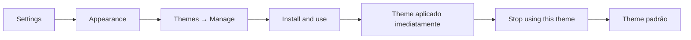

> [!abstract]
> Um **theme** é um pacote CSS feito pela comunidade que redefine a aparência inteira do Obsidian, instalado pelo Community directory e ativo **um de cada vez**.

## Conceito

O theme resolve o problema oposto ao do [[CSS Snippet]]: quando você não quer ajustar um detalhe, mas trocar a identidade visual completa do app. Por isso a instalação é atômica — selecionar um theme substitui o anterior.

Themes ficam em `.obsidian/themes`, dentro da [[Configuration Folder|configuration folder]], junto com plugins, snippets e hotkeys. Isso os torna parte da configuração portátil do vault, e não do estado da instalação.

Do ponto de vista de distribuição, theme e [[Obsidian Plugin|plugin]] são cidadãos do mesmo sistema: ambos têm página pública no Community directory, ambos passam pelo **mesmo scanning automático** de cada versão em busca de vulnerabilidades, problemas de qualidade de código e malware, e ambos exibem o resultado como safety scorecard. A diferença é que o theme é CSS, não código executável.

## Fluxo de instalação

## Características

- Instalar: Settings → Appearance → Themes → **Manage** → selecionar → **`Install and use`**; o Obsidian aplica imediatamente
- Reverter ao padrão: **`Stop using this theme`**; remover de vez: **Uninstall**
- **Themes não atualizam automaticamente** — Appearance → Current community themes → `Check for updates` → `Update all`, ou `Check for updates` no theme individual
- Navegáveis também fora do app, em community.obsidian.md
- O dropdown de Themes mostra o theme ativo; o ícone de pasta abre a pasta `themes` na configuration folder

## Demais opções de Appearance

| Opção | O que faz |
|---|---|
| **Base color scheme** | Adapt to system · Light · Dark |
| **Accent color** | Cor de destaque usada em todo o app |
| **Interface font** | Fonte base de todo o Obsidian |
| **Text font** | Fonte das views de edição e leitura |
| **Monospace font** | Fonte de code blocks e frontmatter |
| **Show inline title** | Exibe o filename como título editável inline; age como heading no Obsidian mas **não adiciona heading à nota** |
| **Show tab title bar** | Exibe o header no topo de cada tab |
| **Show ribbon** | Exibe a barra vertical lateral |
| **Window frame style** | Obsidian frame · Native frame · Hidden frame — **exige restart completo** |
| **Translucent window** | Efeito de profundidade; pensado para macOS, **não suportado no Linux** |
| **Hardware acceleration** | Usa a GPU; desligar pode degradar severamente a performance, mas resolve problemas raros |

## Comparação

| | Theme | [[CSS Snippet]] |
|---|---|---|
| Escopo da mudança | Identidade visual inteira | Um aspecto pontual |
| Ativos ao mesmo tempo | **Um** | **Vários** |
| Distribuição | Community directory, com scorecard | Fórum e GitHub, **sem loja** |
| Instalação | `Install and use` | Copiar `.css` para `snippets/` |
| Onde vive | `.obsidian/themes` | `.obsidian/snippets/` |

> [!tip]
> Os dois se combinam: o theme define a base e os snippets fazem os ajustes finos por cima. A doc de Appearance recomenda exatamente isso — *tweak themes using CSS snippets*.

## Veja também

- [[CSS Snippet]]
- [[Obsidian Plugin]]
- [[Configuration Folder]]
- [[Restricted Mode]]
