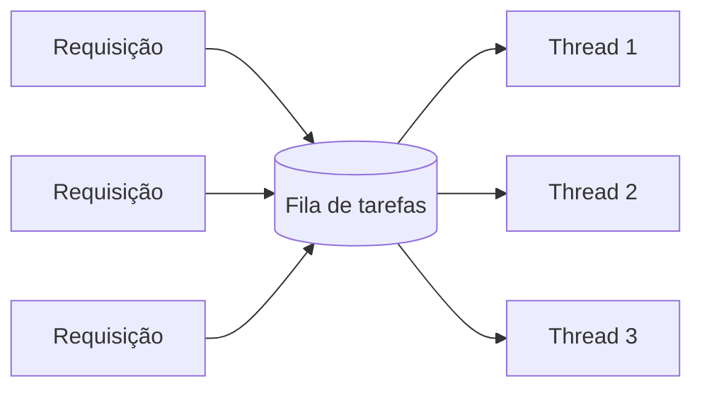

> [!abstract]
> Thread pool é um conjunto **fixo e reutilizável** de [[Thread|threads]] que consomem tarefas de uma fila — a forma de ter concorrência sem pagar a criação de uma thread por tarefa.

## Conceito

Criar uma thread por requisição funciona até o volume subir: cada thread custa memória e troca de contexto, e mil requisições simultâneas viram mil threads disputando o processador. A máquina passa mais tempo trocando de contexto do que trabalhando.

O pool inverte a lógica: um número **limitado** de threads processa uma fila de tarefas.

## O limite é uma decisão, não um detalhe

O tamanho do pool **é** o limite de concorrência do serviço. Ele determina:

- Quantas requisições são processadas ao mesmo tempo
- Quantas ficam esperando na fila
- A partir de que ponto o serviço deixa de responder no prazo

> [!warning] Toda fila é um risco escondido
> A fila do pool acumula requisições que o cliente **já desistiu de esperar**. O servidor as processa mesmo assim, gastando capacidade escassa em trabalho que ninguém vai receber — o desperdício que alimenta o ciclo descrito em [[Load Shedding]].
>
> A correção é limitar não só o **tamanho** da fila, mas **quanto tempo** a tarefa pode ficar nela, descartando o que envelheceu.

## Relação com resiliência

| Padrão | Como usa o pool |
|---|---|
| [[Bulkhead]] | Pools **separados** por dependência: a que trava não esgota as threads das outras |
| [[Timeout]] | Sem timeout, uma chamada remota presa ocupa uma thread indefinidamente até esgotar o pool |
| [[Deadlock]] | Tarefas do pool que esperam por outras tarefas do mesmo pool travam por esgotamento |
| [[Load Shedding]] | Rejeitar quando a fila está cheia é a forma mais direta de descarte |

> [!important]
> "O serviço travou" quase sempre significa "o pool esgotou". A thread não sumiu — está bloqueada esperando alguma coisa que não tem prazo para responder. É o motivo de [[Timeout]] ser o primeiro mecanismo de resiliência a configurar, não o último.

## Fonte

- Andrew S. Tanenbaum, *Modern Operating Systems*, Pearson
- David Yanacek, [Using load shedding to avoid overload](https://aws.amazon.com/builders-library/using-load-shedding-to-avoid-overload/), Amazon Builders' Library

## Veja também

- [[Thread]]
- [[Bulkhead]]
- [[Timeout]]
- [[Load Shedding]]
- [[Deadlock]]
- [[Processo (Computação)]]
- [[System Design MOC]]
