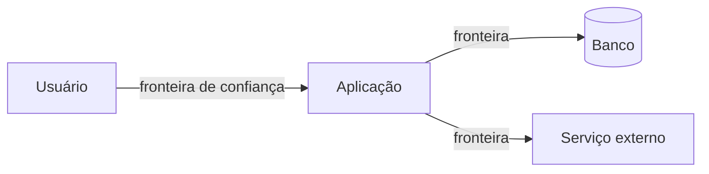

> [!abstract]
> Threat Modeling é a prática de **analisar um sistema para encontrar o que pode dar errado por ação hostil**, antes de construí-lo — segurança por projeto, não por correção.

## Conceito

Testar segurança depois de pronto encontra falhas de implementação. Falhas de **projeto** — uma fronteira de confiança no lugar errado, um dado sensível atravessando um canal indevido — não aparecem em varredura e custam caro para corrigir tarde.

A modelagem responde a quatro perguntas:

1. **No que estamos trabalhando?** — diagrama de fluxo de dados, com as fronteiras de confiança marcadas
2. **O que pode dar errado?** — as ameaças, tipicamente enumeradas por STRIDE
3. **O que vamos fazer a respeito?** — mitigar, transferir, evitar ou aceitar
4. **Fizemos um bom trabalho?** — revisão do próprio processo

## STRIDE

| Letra | Ameaça | Propriedade violada | Mitigação típica |
|---|---|---|---|
| **S**poofing | Fingir ser outro | Autenticidade | [[Authentication]], MFA, mTLS |
| **T**ampering | Alterar dado ou código | Integridade | Assinatura, [[Transport Layer Security (TLS)]], hash |
| **R**epudiation | Negar ter feito | Não repúdio | [[Logging]] assinado, trilha de auditoria |
| **I**nformation disclosure | Vazar informação | Confidencialidade | Cifragem, [[Authorization]] |
| **D**enial of service | Derrubar o serviço | Disponibilidade | [[Rate Limiting]], [[Load Shedding]] |
| **E**levation of privilege | Ganhar permissão indevida | Autorização | Menor privilégio, [[Zero Trust]] |

> [!tip] A fronteira de confiança é onde as ameaças moram
> Cada seta que atravessa uma fronteira é onde vale enumerar STRIDE. Dentro de uma mesma fronteira, o custo de modelar raramente compensa.

> [!important]
> A modelagem é insumo direto de [[Risk Management]]: as ameaças identificadas viram riscos com probabilidade e impacto, e as mitigações escolhidas viram requisitos de arquitetura. Sem essa ligação, o exercício vira documento morto.

## Fonte

- OWASP, [Threat Modeling Cheat Sheet](https://cheatsheetseries.owasp.org/cheatsheets/Threat_Modeling_Cheat_Sheet.html)
- [Threat Modeling Manifesto](https://www.threatmodelingmanifesto.org/)

## Veja também

- [[Risk Management]]
- [[Zero Trust]]
- [[Segurança de API]]
- [[Information Security Management]]
- [[Authorization]]
- [[Firewall]]
