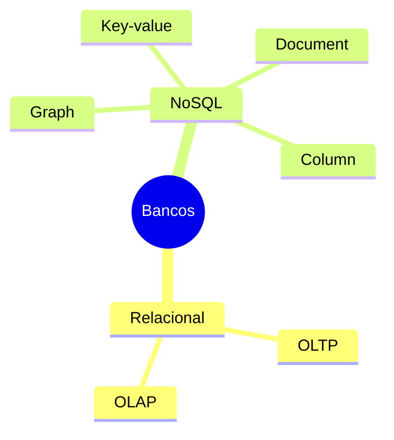

> [!abstract]
> Bancos de dados se dividem por **modelo de dados** — o formato em que a informação é organizada — e essa escolha determina que consultas são naturais e que consultas serão sempre caras.

## Conceito

A pergunta não é qual banco é melhor, é **qual formato corresponde ao acesso predominante**. Um relacionamento entre pessoas modelado em tabelas exige `JOIN` recursivo; o mesmo relacionamento em um grafo é uma travessia. O dado é o mesmo; o custo, não.

## Os modelos

| Tipo | Como organiza | Bom para |
|---|---|---|
| **Relacional** | Tabelas com esquema fixo e relações declaradas | Domínio com regras de integridade e transações [[ACID]] |
| **OLAP** | Otimizado para agregação e análise sobre grandes volumes | Relatórios, [[Business Intelligence]] |
| **Graph** | Nós e arestas, onde o relacionamento é cidadão de primeira classe | Rede social, detecção de fraude, recomendação |
| **Key-value** | Um valor por chave, acesso direto | Cache, sessão, contador — ver [[Distributed Cache]] |
| **Document** | Documentos em formato tipo JSON, esquema flexível | Agregados que são lidos e escritos inteiros |
| **Column** | Armazenamento orientado a coluna | Varredura de poucas colunas sobre muitas linhas |

## OLTP × OLAP

> [!important]
> A divisão mais consequente não é SQL contra NoSQL, é **OLTP contra OLAP**. OLTP atende muitas transações pequenas e concorrentes — o sistema em produção. OLAP varre volumes enormes para responder poucas perguntas grandes — a análise.
>
> Rodar consulta analítica no banco transacional é a causa clássica de degradação em produção, e o motivo de existirem [[Data Warehouse]] e [[Data Lake]].

## Escolhendo

- Comece pelo **padrão de acesso**, não pela tecnologia da moda
- Verifique se as garantias necessárias são [[ACID]] ou se [[BASE]] serve
- Considere o índice: a estrutura por trás dele muda por engine. Ver [[Database Index]]
- Em [[Microservices]], cada serviço escolhe o seu — *database per service* é o que torna a decomposição real

> [!warning]
> "Poliglota" costuma ser vendida como sofisticação e entregue como dívida. Cada banco adicional é mais um sistema para operar, monitorar, fazer backup, atualizar e ter gente que sabe depurar às três da manhã.

## Fonte

- ByteByteGo, *Understanding Database Types* e *What is a database?* — BIG ARCHIVE: System Design 2023

## Veja também

- [[ACID]]
- [[BASE]]
- [[Database Index]]
- [[Database Sharding]]
- [[Data Warehouse]]
- [[Data Lake]]
- [[Distributed Cache]]
- [[System Design MOC]]
