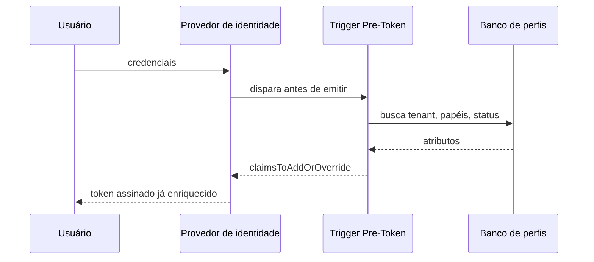

> [!abstract]
> Token enrichment é a injeção de atributos da aplicação — tenant, papéis, estado de conta — dentro do token de identidade no momento da emissão, tornando-os disponíveis e confiáveis em toda requisição sem consulta adicional.

## Conceito

O provedor de identidade sabe *quem* o usuário é. A aplicação sabe *o que ele é dentro do produto*: a que organização pertence, que papéis exerce, se concluiu o onboarding. Sem enriquecimento, essa segunda metade precisa ser buscada no banco a cada requisição — uma leitura extra no caminho crítico de tudo, e uma duplicação de lógica em cada handler.

Ao injetar esses atributos como **claims assinados**, eles passam a viajar com o [[JSON Web Token (JWT)]]. A assinatura do provedor os torna não-falsificáveis, e a borda pode decidir sobre eles sem tocar em nenhum banco.

## O que colocar — e o que não

| Coloque | Não coloque |
|---|---|
| `tenantId` ativo | Dado sensível ou pessoal (o JWT é legível por qualquer um que o tenha) |
| Papéis / grupos | Listas grandes — o token viaja em todo cabeçalho HTTP |
| `userId` interno (distinto do `sub` do provedor) | Qualquer coisa que mude com frequência maior que a validade do token |
| Estado de gate (onboarding, plano) | Permissões granulares por recurso |

> [!warning] O claim é um retrato, não um espelho
> O token reflete o estado do usuário **no instante da emissão**. Revogar um papel não invalida os tokens já emitidos: o acesso persiste até a expiração. Isso define dois requisitos — validade curta do access token, e um caminho de revogação explícito (invalidar o refresh token, forçar re-login) para mudanças críticas de permissão.

## Consequência de projeto

Quando o `tenantId` está no token, três coisas ficam possíveis de uma vez: o [[Lambda Authorizer]] valida isolamento sem I/O, o handler lê o tenant do contexto em vez do cabeçalho, e o frontend renderiza o gate correto sem uma chamada de API extra ao carregar. Sem o enriquecimento, cada uma dessas três precisa de uma consulta própria.

O custo é acoplamento: o trigger passa a ser dependência crítica do login. Se ele falha, ninguém entra. Se ele demora, todo login demora.

## Veja também

- [[Amazon Cognito]]
- [[JSON Web Token (JWT)]]
- [[Lambda Authorizer]]
- [[Multi-Tenancy]]
- [[Authorization]]
- [[OpenID Connect]]
