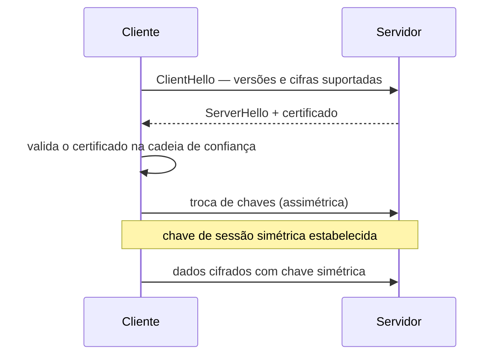

> [!abstract]
> TLS é o protocolo que cifra e autentica a comunicação em trânsito. HTTPS é [[HTTP]] transportado sobre TLS — nada mais que isso.

## Conceito

TLS entrega três garantias sobre o canal: **confidencialidade** (quem intercepta não lê), **integridade** (quem intercepta não altera sem ser notado) e **autenticidade** (o servidor é mesmo quem diz ser, provado por certificado emitido por uma autoridade confiável).

*SSL* é o nome do antecessor, obsoleto e inseguro; o protocolo em uso é TLS, mas o termo antigo sobreviveu no vocabulário ("certificado SSL", "SSL handshake").

## O handshake

> [!important] Os dois tipos de criptografia trabalham juntos
> O handshake usa **criptografia assimétrica** para estabelecer a chave de sessão — é seguro, mas lento. Toda a comunicação seguinte usa **criptografia simétrica** com essa chave — rápida o suficiente para volume. Ver [[Criptografia Simétrica e Assimétrica]].
>
> Essa combinação é a razão de o handshake ser o trecho caro da conexão, e por que ele aparece como causa raiz de timeouts logo após cada deploy. Ver [[Timeout]].

## Características

- **TLS 1.3** reduz o handshake a uma viagem de ida e volta e remove cifras legadas
- O certificado prova a identidade do **servidor**; provar a do cliente também é **mTLS**, comum em [[Service Mesh]]
- **HSTS** força o navegador a nunca aceitar a versão sem cifra do site

> [!warning]
> TLS protege o dado **em trânsito**. Não protege o dado em repouso nem o dado depois que chega ao servidor. "Temos HTTPS" não é uma resposta a "os dados estão seguros?".

## Fonte

- OWASP, [Transport Layer Security Cheat Sheet](https://cheatsheetseries.owasp.org/cheatsheets/Transport_Layer_Security_Cheat_Sheet.html)
- IETF, [RFC 8446 — TLS 1.3](https://datatracker.ietf.org/doc/html/rfc8446)

## Veja também

- [[Criptografia Simétrica e Assimétrica]]
- [[HTTP]]
- [[Segurança de API]]
- [[Service Mesh]]
- [[Timeout]]
- [[System Design MOC]]
