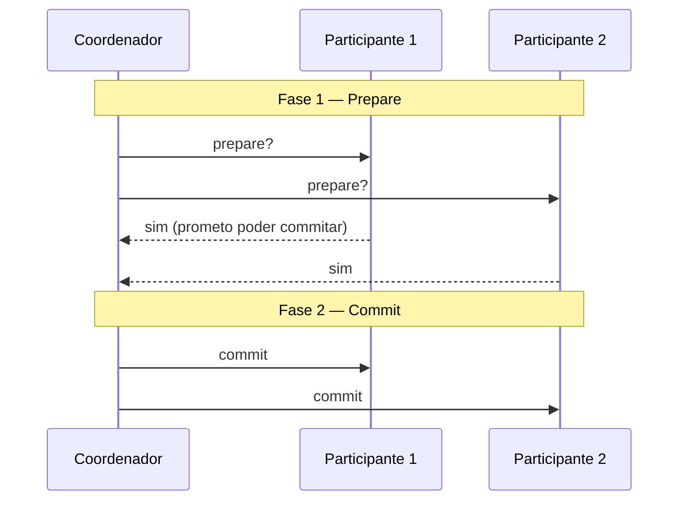

> [!abstract]
> Two-Phase Commit é o algoritmo que garante commit atômico entre vários nós: ou **todos** confirmam a transação, ou **todos** a abortam.

## Conceito

Commit atômico é trivial em um nó só e difícil quando a transação envolve vários. Não basta mandar `commit` para cada um independentemente: um pode confirmar e outro falhar, deixando o sistema em estado inconsistente e sem volta.

O 2PC resolve introduzindo um **coordenador** e separando a decisão em duas fases.

## As duas fases

**Fase 1 — prepare.** O coordenador pergunta a cada participante se ele consegue commitar. Ao responder "sim", o participante faz uma **promessa irrevogável**: ele garante que conseguirá commitar depois, aconteça o que acontecer.

**Fase 2 — commit ou abort.** Se todos disseram sim, o coordenador grava a decisão e manda commitar. Se qualquer um disse não, manda abortar. A decisão do coordenador também é irrevogável.

## A limitação que o inviabiliza

> [!warning] O 2PC bloqueia
> Se o coordenador cai **entre** as duas fases, os participantes que já prometeram ficam presos: não podem commitar (não receberam ordem) nem abortar (já prometeram). Ficam segurando locks, indefinidamente. Se o coordenador não se recupera, a saída é **intervenção manual**.

Esse é o motivo pelo qual, em arquiteturas de [[Microservices]], 2PC aparece listado como restrição — "2PC is not an option" — e não como solução. Some-se a isso que muitos bancos e brokers de mensagem simplesmente não o suportam, e que usá-lo acoplaria o serviço a ambos.

## Comparação

| | **Two-Phase Commit** | **[[Saga]]** |
|---|---|---|
| Atomicidade | Garantida pelo protocolo | Aproximada por compensação |
| Isolamento | Preservado | Perdido |
| Rollback | Automático | Manual, projetado caso a caso |
| Disponibilidade | Bloqueia se o coordenador cair | Não bloqueia |
| Acoplamento | Alto entre todos os participantes | Baixo |

> [!important] 2PC não é 2PL
> *Two-Phase Commit* é um algoritmo de consenso para commit atômico entre nós. *Two-Phase Locking* é um mecanismo de controle de concorrência para garantir serializabilidade dentro de um banco. Nomes parecidos, problemas diferentes.

## Fonte

- Martin Kleppmann, *Designing Data-Intensive Applications*, cap. 9 "Consistency and Consensus", O'Reilly, 2017
- Chris Richardson, [Pattern: Saga](https://microservices.io/patterns/data/saga.html), microservices.io

## Veja também

- [[Saga]]
- [[Consensus]]
- [[Outbox Pattern]]
- [[Eventual Consistency]]
- [[Microservices]]
- [[System Design MOC]]
