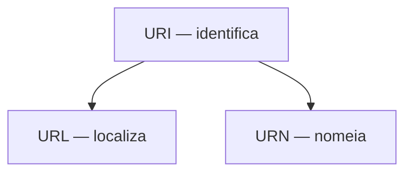

> [!abstract]
> **URI** identifica um recurso. **URL** e **URN** são subtipos dela: a URL diz *onde* o recurso está, a URN diz *como ele se chama*.

## Conceito

Os três termos são usados como sinônimos no dia a dia, e a hierarquia entre eles é simples:



- **URI** — *Uniform Resource Identifier*. Identifica um recurso lógico ou físico na web
- **URL** — *Uniform Resource Locator*. É o **endereço** de um recurso único. Conceito central de [[HTTP]], mas usado também com FTP, JDBC e outros
- **URN** — *Uniform Resource Name*. Usa o esquema `urn:` e **não pode ser usada para localizar** o recurso, só para nomeá-lo de forma persistente

## Anatomia de uma URI

```text
scheme:[//authority]path[?query][#fragment]
```

| Parte | Exemplo | Papel |
|---|---|---|
| **scheme** | `https` | Protocolo ou espaço de nomes |
| **authority** | `api.exemplo.com:443` | Host e porta — resolvido via [[DNS]] |
| **path** | `/v1/pedidos/42` | Caminho até o recurso |
| **query** | `?status=aberto` | Parâmetros |
| **fragment** | `#itens` | Trecho dentro do recurso; **não é enviado ao servidor** |

Exemplo de URN: `urn:isbn:0451450523` — nomeia o livro sem dizer onde encontrá-lo.

> [!important] Por que a distinção importa em [[REST API]]
> Em REST, a **identificação de recursos** é uma das quatro restrições da interface uniforme. A URI é o identificador; a representação devolvida é outra coisa. Confundir os dois é o que leva a URIs com verbo — `/getPedido` em vez de `GET /pedidos/42`.

> [!warning]
> O fragmento (`#`) é processado **apenas pelo cliente**. Colocar informação relevante ali significa que o servidor nunca a verá — armadilha clássica em aplicações de página única.

## Fonte

- T. Berners-Lee, R. Fielding e L. Masinter, [RFC 3986 — Uniform Resource Identifier (URI): Generic Syntax](https://datatracker.ietf.org/doc/html/rfc3986), IETF, 2005

## Veja também

- [[HTTP]]
- [[REST API]]
- [[DNS]]
- [[Estratégias de Cache]]
- [[System Design MOC]]
