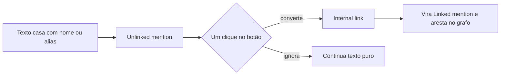

> [!abstract]
> **Unlinked mention** é a ocorrência de um nome de nota (ou de um [[Alias (Obsidian)]]) em texto puro, sem link — uma aresta que existe semanticamente no vault mas ainda não existe no índice.

## Conceito

O conceito aparece nos dois painéis laterais, com escopos espelhados:

- Em **Backlinks**, unlinked mentions são as ocorrências não linkadas do nome da **nota ativa** em outras notas — quem *poderia* estar te citando.
- Em **Outgoing links**, unlinked mentions são os trechos da **nota ativa** que casam com o nome ou o alias de outra nota do vault — quem *você* poderia estar citando.

> [!quote]
> Unlinked mentions helps you discover links you aren't aware of yet.

> [!success] Serendipidade estruturada
> A rede de um vault não é só a que você desenhou de propósito. Escrevendo, você repete nomes sem lembrar que existe uma nota com aquele nome — o painel devolve essas coincidências como candidatas. É descoberta, mas descoberta com trilho: só emerge o que casa com um nome ou alias já existente. Por isso a qualidade dos aliases determina a taxa de descoberta.

## Estrutura / Fluxo

## Características

- Conversão em **um clique**: basta clicar no botão com o nome da nota para transformar a menção em [[Internal Link (Wikilink)]].
- Homônimos: menções podem apontar para notas diferentes com o mesmo nome — **hover sobre o botão mostra o caminho completo** da nota, o que desambigua antes de linkar.
- Aliases geram unlinked mentions. Definido `AI` como alias de `Artificial intelligence`, as ocorrências de "AI" aparecem no painel; ao converter, o Obsidian usa o alias como **display text**.
- Dentro de **code blocks** é possível criar o link a partir da menção, mas ele **não aparece na seção Links** do painel Outgoing links, pela natureza do bloco de código.
- Arquivos que casam com os padrões de **Excluded files** não aparecem em Unlinked mentions — nem no Backlinks, nem no Outgoing links.

## Comparação

| | Linked mention | Unlinked mention |
|---|---|---|
| Existe no índice | Sim | Não |
| Aparece no [[Graph View]] | Sim, como aresta | Não |
| Origem | Link escrito | Casamento textual com nome ou alias |
| Ação | Navegar | Converter em link, ou ignorar |
| Efeito de renomear | Atualizado automaticamente | Deixa de casar |

## Veja também

- [[Backlink]]
- [[Alias (Obsidian)]]
- [[Internal Link (Wikilink)]]
- [[Graph View]]
- [[Diagnóstico do Grafo de Conhecimento]]
