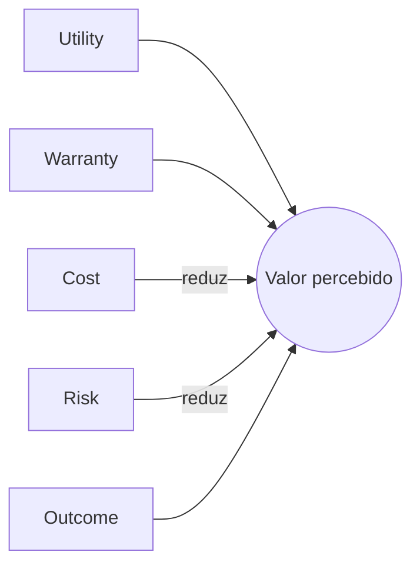

> [!abstract]
> Valor é o benefício percebido, a utilidade e a importância de algo — sempre do ponto de vista de quem o percebe, e não de quem o produz.

## Conceito

A definição carrega a decisão mais consequente do ITIL: valor é **subjetivo e contextual**. Não é uma propriedade do serviço, é um julgamento do consumidor. Dois consumidores do mesmo serviço podem perceber valores opostos, e ambos estão certos.

Daí decorre que valor não pode ser entregue — só pode ser cocriado. O provedor cria as condições; o consumidor decide se houve valor.

## Estrutura

## Características

- Percebido, não entregue
- Relativo ao contexto e ao momento do consumidor
- Composto por utilidade e garantia, líquido de custo e risco
- Muda ao longo do tempo, mesmo com serviço constante

## Veja também

- [[Value Co-Creation]]
- [[Outcome]]
- [[Cost]]
- [[Risk]]
- [[Utility]]
- [[Warranty]]
- [[Focus on Value]]
